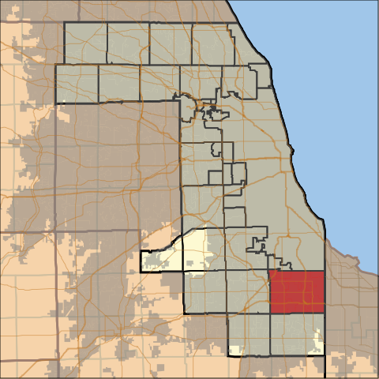
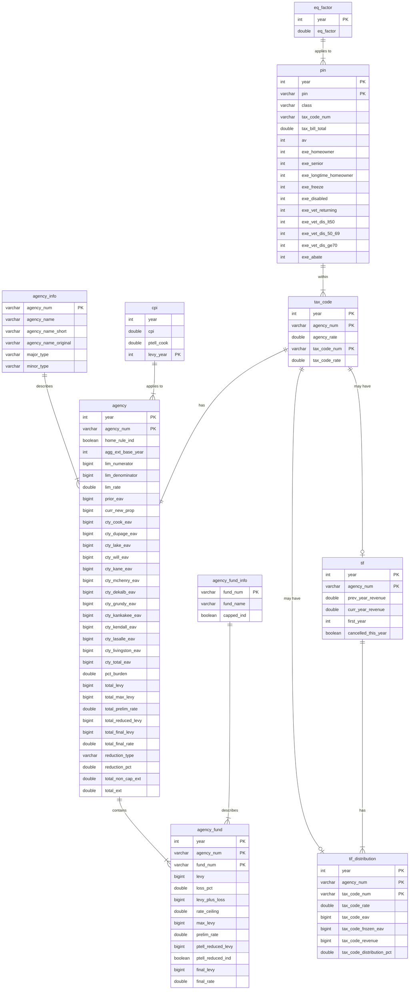
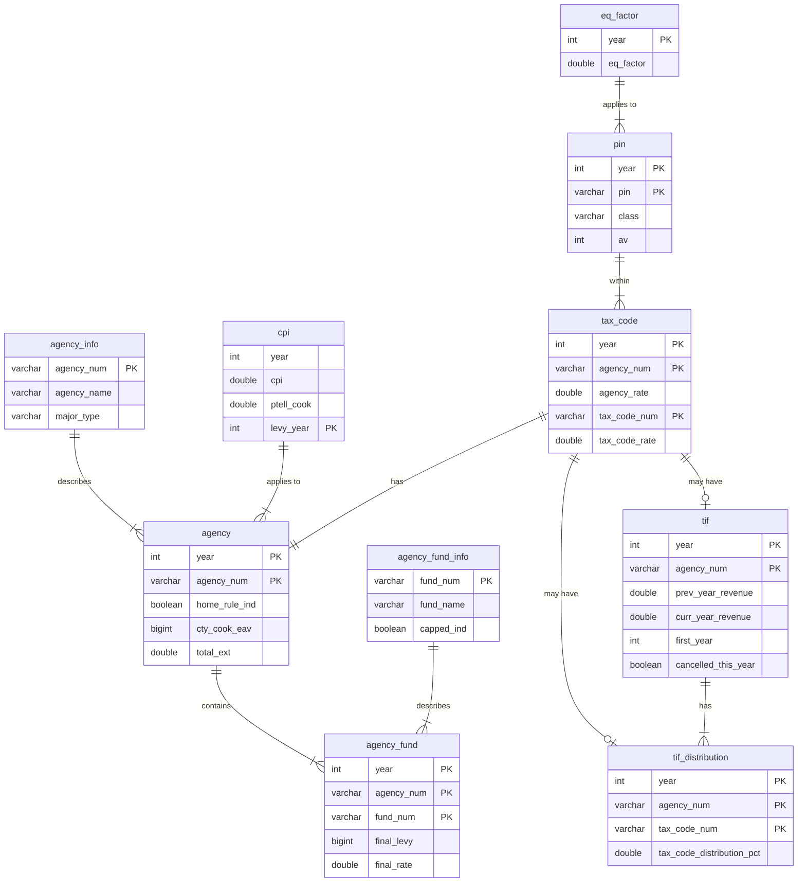

<!-- README.md is generated from README.Rmd. Please edit that file -->

```{r opts, include = FALSE}
knitr::opts_chunk$set(
  collapse = TRUE,
  comment = "#>",
  fig.path = "man/figures/README-",
  out.width = "100%"
)
```

# PTAXSIM package <a href='https://gitlab.com/ccao-data-science---modeling/packages/ptaxsim'></a>

> :warning: NOTE: PTAXSIM relies on a separate SQLite database to function correctly. You must download and decompress the database before using this package!
> See [Database installation](#database-installation) for details.
>
> [**Link to PTAXSIM database**](https://ccao-data-public-us-east-1.s3.amazonaws.com/ptaxsim/ptaxsim.db.zst)

PTAXSIM is an R package/database to approximate Cook County property tax bills. It uses real assessment, exemption, TIF, and levy data to generate historic, line-item tax bills (broken out by taxing district) for any property from 2006 to `r max(ptaxsim::sample_tax_bills_summary$year)`. Given some careful assumptions and data manipulation, it can also generate counterfactual property tax bills to answer questions such as:

* What would my property tax bill be if my assessed value was $10K lower?
* What would my property tax bill be if I received a new exemption?
* What would my property tax bill be if my school district increased its levy by 5%?
* What would my property tax bill be if a large new development was added to my neighborhood?

PTAXSIM can generate hundreds, or even millions, of tax bills in a single function call, which enables complex tax analysis on a municipality or even county level. PTAXSIM is accurate (within $10 of the real bill) for >99% of historic property tax bills. However, it is currently an experimental tool only and is *not* recommended for critical use. See [Notes](#notes) and [Disclaimer](#disclaimer) for more information.

For detailed documentation on included functions and data, [**visit the full reference list**](https://ccao-data-science---modeling.gitlab.io/packages/ptaxsim/reference/).

For examples of PTAXSIM's functionality and usage, see the [**vignettes page**](https://ccao-data-science---modeling.gitlab.io/packages/ptaxsim/articles/index.html).

## Installation

### Package installation

You can install the released version of `ptaxsim` directly from GitLab by running the following R command after installing [remotes](https://github.com/r-lib/remotes):

```{r, eval=FALSE}
remotes::install_gitlab("ccao-data-science---modeling/packages/ptaxsim")
```

Occasionally, when using brand-new or source versions of packages, installation [on Windows fails with the following error](https://github.com/rstudio/renv/issues/162):

```
DLL 'package_name' not found: maybe not installed for this architecture?
```

If this happens, try using the following installation command:

```{r, eval=FALSE}
remotes::install_gitlab(
  repo = "ccao-data-science---modeling/packages/ptaxsim",
  INSTALL_opts = "--no-multiarch"
)
```

### Database installation

PTAXSIM relies on a separate SQLite database to function correctly. This database contains the information about properties, taxing districts, and TIF districts necessary to calculate tax bills. To use this database:

1. Download the compressed database file from the CCAO's public S3 bucket. [Link here](https://ccao-data-public-us-east-1.s3.amazonaws.com/ptaxsim/ptaxsim.db.zst).
2. Decompress the downloaded database file. The file is compressed using [zstd](https://github.com/facebook/zstd), which needs to be installed separately.
3. Place the decompressed database file in a convenient location, preferably at the root of your R project.
4. At the beginning of your project, instantiate a [DBI](https://dbi.r-dbi.org/) connection to the database file with the name `ptaxsim_db_conn`. The PTAXSIM R functions look for this connection object name by default. If you wish to change the name, you can pass the custom named object to the `conn` argument of each PTAXSIM function. Below is a sample DBI connection:

```{r db_conn, message=FALSE}
library(dplyr)
library(ptaxsim)

# Create the DB connection with the default name expected by PTAXSIM functions
ptaxsim_db_conn <- DBI::dbConnect(RSQLite::SQLite(), "./ptaxsim.db")
```

## Usage

PTAXSIM has a single primary function - `tax_bill()` - with two main arguments:

1. `year_vec` - A numeric vector of tax years
2. `pin_vec` - A character vector of Property Index Numbers (PINs)

The output is a data frame of the tax amount directed to each taxing body, by PIN and year. By default, `tax_bill()` can only generate _historic_ tax bills; it cannot generate future or counterfactual bills. To generate future/counterfactual bills, you must provide additional data to `tax_bill()` via its secondary arguments. See [Counterfactual scenarios](#counterfactual-scenarios) for more details.

### Single bill, single year

The simplest use of `tax_bill()` is to calculate a single bill for a single year:

```{r single_bill_1, message=FALSE}
single_bill <- tax_bill(year_vec = 2020, pin_vec = "17341020511001")
single_bill
```

To compare this output to a real tax bill, we can reorder the rows and keep only the columns that appear on an actual printed bill.

```{r single_bill_2, message=FALSE}
single_bill %>%
  select(agency_name, final_tax, agency_tax_rate) %>%
  mutate(agency_tax_rate = agency_tax_rate * 100) %>%
  arrange(-row_number()) %>%
  setNames(c("Agency", "2020 Tax", "2020 Rate")) %>%
  knitr::kable("html", digits = 3)
```

Here's the real 2020 tax bill for this PIN for comparison:


There are some minor differences between PTAXSIM and the real bill. The taxing district names may not be identical. Additionally, PTAXSIM aggregates the different Cook County agencies (Public Safety, Health Facilities, and County of Cook) into a single line-item (COUNTY OF COOK).

### Single bill, multiple years

We can also look at a single property over multiple years, in this case broken out by taxing district. To do so, pass a vector of multiple years to the `year_vec` argument of `tax_bill()`:

```{r mutli_year_1, message=FALSE, warning=FALSE}
multiple_years <- tax_bill(2010:2020, "14081020210000") %>%
  select(year, av, agency_name, agency_minor_type, final_tax)

# Sort by taxing district name and display the first 10 rows of data
multiple_years %>%
  arrange(agency_name, year) %>%
  slice_head(n = 11) %>%
  knitr::kable("html", digits = 3)
```

The result is a tax amount per taxing district, per PIN, per year. We can collapse these amounts and then plot them to see how a single PIN has changed over time:

```{r mutli_year_2, message=FALSE, warning=FALSE}
multiple_years_summ <- multiple_years %>%
  group_by(year, agency_minor_type) %>%
  summarize(final_tax = sum(final_tax)) %>%
  mutate(
    agency_minor_type = factor(
      agency_minor_type,
      levels = c(
        "TIF", "BOND", "COOK", "LIBRARY",
        "MUNI", "PARK", "SCHOOL", "WATER"
      )
    )
  )
```  

<details>

<summary>Show code for plot</summary>

```{r mutli_year_3, message=FALSE, warning=FALSE}
library(ggplot2)

# Plot the amount of taxes going to each district over time
multiple_years_plot <- ggplot(data = multiple_years_summ) +
  geom_area(aes(x = year, y = final_tax, fill = agency_minor_type)) +
  geom_vline(xintercept = 2016, linetype = "dashed", alpha = 0.3) +
  annotate(
    "text",
    x = 2015.8,
    y = 12500,
    label = "RPM TIF enacted",
    hjust = 1
  ) +
  scale_y_continuous(
    name = "Total Tax Amount",
    labels = scales::dollar,
    expand = c(0, 0)
  ) +
  scale_x_continuous(name = "Year", n.breaks = 7) +
  scale_fill_manual(values = scales::hue_pal()(8)) +
  theme_minimal() +
  guides(fill = guide_legend(title = "District Type"))
```

</details>

```{r mutli_year_4, message=FALSE, warning=FALSE, echo=FALSE}
multiple_years_plot
```

### Counterfactual scenarios

PTAXSIM can also perform more complex analysis, such as measuring the impact of exemptions in a given area. To perform this analysis, we can use the `tax_bill()` function to calculate tax bills before and after exemptions are removed.

Let's look at the effect of exemptions in the Cook County township of Thornton:



```{r complex_1, message=FALSE, warning=FALSE}
library(data.table)

# Use the included database to get all unique PINs in Thornton township
t_pins <- DBI::dbGetQuery(
  ptaxsim_db_conn,
  "
  SELECT DISTINCT pin
  FROM pin
  WHERE substr(tax_code_num, 1, 2) = '37'
  "
)
t_pins <- t_pins$pin
t_years <- 2006:2020

# Generate all tax bills for Thornton, 2006 - 2020, with exemptions
t_pre <- tax_bill(t_years, t_pins)[, stage := "With exemptions"]

# Lookup exemptions and tax code for all Thornton pins
t_pin_dt <- lookup_pin(t_years, t_pins)
t_pin_dt[, tax_code := lookup_tax_code(year, pin)]

# For each tax code, calculate the total EAV recovered by removing exemptions
exe_cols <- names(t_pin_dt)[startsWith(names(t_pin_dt), "exe_")]
t_tc_sum <- t_pin_dt[,
  exe_total := rowSums(.SD), .SDcols = exe_cols
][,
  .(exe_total = sum(exe_total)), by = .(year, tax_code)
]

# Recalculate Thornton's tax base by adding EAV returned from exemptions to each
# taxing district's total EAV
t_agency_dt <- lookup_agency(t_years, t_pin_dt$tax_code)
t_agency_dt[t_tc_sum, on = .(year, tax_code), added_eav := exe_total][
  , agency_total_eav := agency_total_eav + added_eav
][, added_eav := NULL]

# Remove all PIN-level exemptions
t_pin_dt[, (exe_cols) := 0][, c("exe_total", "tax_code") := NULL]

# Recalculate all tax bills after exemptions are removed + new base
t_post <- tax_bill(
  year_vec = t_years,
  pin_vec = t_pins,
  agency_dt = t_agency_dt,
  pin_dt = t_pin_dt
)[, stage := "Without exemptions"]

# Little function to get the statistical mode
Mode <- function(x) {
  ux <- unique(x)
  ux[which.max(tabulate(match(x, ux)))]
}

# Calculate the average tax bill by major class, with and without exemptions
# Index the resulting average to 2006
t_summ <- rbind(t_pre, t_post)[, class := Mode(substr(class, 1, 1)), by = pin][
  class %in% c("2", "3", "5"),
][
  , class := ifelse(class == "2", "Residential", "Commercial")
][
  , .(total_bill = sum(final_tax)), by = .(year, pin, class, stage)
][
  , .(avg_bill = mean(total_bill)), by = .(year, class, stage)
][
  , idx_bill := (avg_bill / avg_bill[year == 2006]) * 100, by = .(class, stage)
]

```

<details>

<summary>Show code for plot</summary>

```{r complex_2, message=FALSE, warning=FALSE}
t_annot <- tibble(
  class = c("Residential", "Commercial"),
  x = c(2008, 2006.4),
  y = c(105, 115)
)

# Plot the change in indexed values over time 
t_summ_plot <- ggplot(data = t_summ) +
  geom_line(aes(x = year, y = idx_bill, color = class, linetype = stage)) +
  geom_text(data = t_annot, aes(x = x, y = y, color = class, label = class), hjust = 0) + 
  scale_y_continuous(name = "Average Tax Bill, Indexed to 2006") +
  scale_x_continuous(name = "Year", n.breaks = 10, limits = c(2006, 2020.4)) +
  scale_linetype_manual(
    name = "",
    values = c("With exemptions" = "solid", "Without exemptions" = "dashed")
  ) +
  scale_color_brewer(name = "", palette = "Set1", direction = -1) +
  guides(color = "none") +
  facet_wrap(vars(class)) +
  theme_minimal() +
  theme(
    legend.position = "bottom",
    axis.title = element_text(size = 13),
    axis.title.x = element_text(margin = margin(t = 6)),
    axis.title.y = element_text(margin = margin(r = 6)),
    legend.text = element_text(size = 12),
    strip.text = element_blank()
  )
```

</details>

```{r complex_3, message=FALSE, warning=FALSE, echo=FALSE}
t_summ_plot
```

# Notes

- The PTAXSIM database is updated whenever all the data necessary to calculate a new tax year becomes available. Typically this occurs roughly a year after assessments are mailed i.e. 2019 bill data was available in mid-2020. 
- Currently, the per-district tax calculations for properties in the RPM TIF are slightly flawed. However, the total tax bill per PIN is still accurate. See issue #11 for more information.
- PTAXSIM is a currently a developer and researcher-focused package. It is not intended to predict or explain individual bills. In the future, we plan to make PTAXSIM more accessible via a web frontend and API. 
- PTAXSIM is relatively memory-efficient and can calculate every district line-item for every tax bill for the last 15 years (roughly 350 million rows). However, the memory requirements for this calculation are substantial (around 100 GB).

# Database Diagram 

The PTAXSIM backend database contains cleaned up data from the Cook County Clerk, Treasurer, and Assessor. The database diagram below shows the logical relationship between the PTAXSIM tables. See the `data-raw/` directory for the source of each table's data.

<details>

<summary>Show full database diagram</summary>



</details>



# Disclaimer

This package and the included database are for educational purposes only. The Assessor's office releases the package and database without any representations or warranties of any kind, whether express or implied. Any data, figures, or amounts contained within the package/database, used by the package/database, or produced by the package are solely for illustrative purposes.

Any results produced by this package as distributed are not official and should not be relied upon for any business or commercial purpose. They merely demonstrate the package's features. The Assessor's office expressly disclaims any liability for any entity's reliance on this package and/or database.