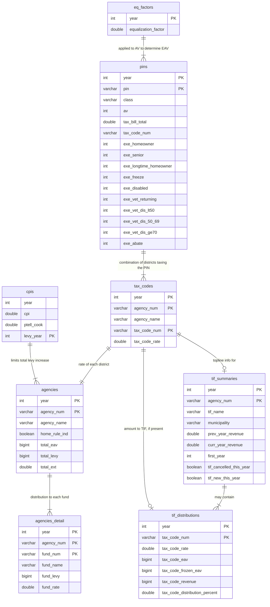

<!-- README.md is generated from README.Rmd. Please edit that file -->

```{r opts, include = FALSE}
knitr::opts_chunk$set(
  collapse = TRUE,
  comment = "#>",
  fig.path = "man/figures/README-",
  out.width = "100%"
)
```

# PTAXSIM package <a href='https://gitlab.com/ccao-data-science---modeling/packages/ptaxsim'></a>

> :warning: NOTE: PTAXSIM relies on a separate SQLite database to function correctly. You must download and decompress the database before using this package!
> See [Database installation](#database-installation) for details.
>
> [**Link to PTAXSIM database**](https://ccao-data-public-us-east-1.s3.amazonaws.com/ptaxsim/ptaxsim.db.zst)

PTAXSIM is an R package/database to approximate Cook County property tax bills. It uses real assessment, exemption, TIF, and levy data to generate line-item tax bills (broken out by taxing district) for any PIN from 2006 to `r max(ptaxsim::sample_tax_bills_summary$year)`. Given some careful assumptions and data manipulation, it can also answer counterfactual property tax questions such as:

* What would my property tax bill be if my assessed value was $10K lower?
* What would my property tax bill be if I received a new exemption?
* What would my property tax bill be if my school district increased its levy by 5%?
* What would my property tax bill be if a large new development was added to my neighborhood?

PTAXSIM can generate hundreds, or even millions, of tax bills in a single function call, which enables complex tax analysis on a municipality or even county level. PTAXSIM is accurate (within $10 of the real bill) for >99% of historic property tax bills. However, it is currently an experimental tool only and is *not* recommended for critical use. See [Notes](#notes) and [Disclaimer](#disclaimer) for more information.

For detailed documentation on included functions and data, [**visit the full reference list**](https://ccao-data-science---modeling.gitlab.io/packages/ptaxsim/reference/).

For examples of PTAXSIM's functionality and usage, see the [**vignettes page**](https://ccao-data-science---modeling.gitlab.io/packages/ptaxsim/articles/index.html).

## Installation

### Package installation

You can install the released version of `ptaxsim` directly from GitLab by running the following R command after installing [remotes](https://github.com/r-lib/remotes):

```{r, eval=FALSE}
remotes::install_gitlab("ccao-data-science---modeling/packages/ptaxsim")
```

Occasionally, when using brand-new or source versions of packages, installation [on Windows fails with the following error](https://github.com/rstudio/renv/issues/162):

```
DLL 'package_name' not found: maybe not installed for this architecture?
```

If this happens, try using the following installation command:

```{r, eval=FALSE}
remotes::install_gitlab(
  repo = "ccao-data-science---modeling/packages/ptaxsim",
  INSTALL_opts = "--no-multiarch"
)
```

### Database installation

PTAXSIM relies on a separate SQLite database to function correctly. This database contains the information about PINs, taxing districts, and TIFs necessary to calculate tax bills. To use this database:

1. Download the compressed database file from the CCAO's public S3 bucket. [Link here](https://ccao-data-public-us-east-1.s3.amazonaws.com/ptaxsim/ptaxsim.db.zst).
2. Decompress the downloaded database file. The file is compressed using [zstd](https://github.com/facebook/zstd), which needs to be installed separately.
3. Place the decompressed database file in a convenient location, preferably at the root of your R project.
4. At the beginning of your project, instantiate a [DBI](https://dbi.r-dbi.org/) connection to the database file with the name `ptaxsim_db_conn`. The PTAXSIM R functions look for this connection object name by default. If you wish to change the name, you can pass the custom named object to the `conn` argument of each PTAXSIM lookup function. See below for an example DBI connection.

## Usage

### Single bill, single year, no TIF

PTAXSIM's most basic functionality is to calculate a property tax bill. To begin, instantiate the database object and calculate a single tax bill:

```{r single_bill_no_tif, message=FALSE}
library(ccao)
library(dplyr)
library(ggplot2)
library(ptaxsim)

# Create the DB connection with the default name expected by PTAXSIM functions
ptaxsim_db_conn <- DBI::dbConnect(RSQLite::SQLite(), "./ptaxsim.db")

# Calculate a single bill for a single year, no TIF
tax_bill(2019, "31112170130000") %>%
  select(agency_name, final_tax_to_dist, agency_tax_rate) %>%
  mutate(agency_tax_rate = agency_tax_rate * 100) %>%
  arrange(-row_number()) %>%
  setNames(c("Agency", "Tax to Dist.", "Rate")) %>%
  knitr::kable("html", digits = 3)
```

Note that the default output of `tax_bill()` is by taxing district, similar to a printed tax bill. Here's the real 2019 tax bill for this PIN for comparison:


There are some minor differences between PTAXSIM and the real bill. The taxing district names may not be perfectly identical. Additionally, PTAXSIM aggregates the different Cook County agencies (Public Safety, Health Facilities, and County of Cook) into a single line-item (COOK COUNTY).

### Single bill, single year, within a TIF

Let's look at one more major difference: TIF districts. Here's the output from PTAXSIM for a property within a TIF:

```{r single_bill_w_tif, message=FALSE}
# Calculate a single bill for a single year, within a TIF
tax_bill(2020, "17341020511001") %>%
  select(agency_name,, final_tax_to_tif, final_tax_to_dist, agency_tax_rate) %>%
  mutate(agency_tax_rate = agency_tax_rate * 100) %>%
  arrange(-row_number()) %>%
  setNames(c("Agency", "Tax to TIF", "Tax to Dist.", "Rate")) %>%
  knitr::kable("html")
```

The real bill collapses the various amounts dedicated from each district to the TIF into a single line-item: **TIF-Chicago-Bronzeville**. The sum of the `Tax to TIF` column is equal to that line item.


### Single bill, multiple years

We can also look at a single property over multiple years, in this case broken out by taxing district. To do so, simply pass a vector of years to the `year` argument of `tax_bill()`:

```{r single_bill_multi_year, message=FALSE, warning=FALSE}
# Calculate multiple bills for a single PIN
tax_bill(2010:2020, "33312020310000") %>%
  select(
    year, pin, av, agency_name, agency_tax_rate,
    final_tax_to_dist, final_tax_to_tif
  ) %>%

# Plot the amount of taxes going to each district over time
ggplot() +
  geom_area(aes(x = year, y = final_tax_to_dist, fill = agency_name)) +
  geom_vline(xintercept = 2016, linetype = "dashed", alpha = 0.3) +
  annotate("text", x = 2016.2, y = 3500, label = "New exemptions applied", hjust = 0) +
  scale_y_continuous(
    name = "Tax Amount",
    labels = scales::dollar,
    expand = c(0, 0)
  ) +
  scale_x_continuous(name = "Year", n.breaks = 7) +
  scale_fill_manual(values = scales::hue_pal()(15), label = abbreviate) +
  theme_minimal() +
  guides(fill = guide_legend(title = "District Name"))
```

Here you can clearly see a large drop in billed taxes; the result of new exemptions applied to this property. See the single property analysis vignette for more information about how to disaggregate the effects of levy, exemption, base, and assessment changes.

### Multiple bills, multiple years

PTAXSIM can also generate data for more complex analysis. For example, we can compare changes in tax amounts across different property classes. This will show (roughly) how the tax burden has changed over time.

To perform this analysis, we can use PTAXSIM to calculate bills for multiple PINs and years. Simply provide all the years and PINs you need to the `tax_bill()` function. By default, `tax_bill()` will get the Cartesian product of your PIN and year inputs.

```{r multi_bills_multi_years, message=FALSE, warning=FALSE, eval=FALSE}

# Get all class 203 (single-family home) and 517 (one story commercial) PINs
pins <- DBI::dbGetQuery(
  ptaxsim_db_conn,
  "
  SELECT DISTINCT
    pin
  FROM pins
  "
)

# Little function to get the modal class of each PIN
Mode <- function(x) {
  ux <- unique(x)
  ux[which.max(tabulate(match(x, ux)))]
}

temp <- pins %>%
  mutate(
    taxable_eav = eav - rowSums(across(starts_with("exe_"))),
    taxable_eav = ifelse(taxable_eav >= 0, taxable_eav, 0)
  ) %>%
  group_by(pin) %>%
  mutate(class = Mode(substr(class, 1, 1))) %>%
  group_by(year, class) %>%
  summarise(
    avg_bill = sum(tax_bill_total),
    avg_eav = sum(taxable_eav),
    avg_av = sum(av)
  ) %>%
  group_by(class) %>%
  mutate(
    idx_bill = avg_bill / avg_bill[year == 2006],
    idx_av = avg_av / avg_av[year == 2006],
    idx_eav = avg_eav / avg_eav[year == 2006]
  )
  
temp2 <- temp %>%
  tidyr::pivot_longer(c(idx_bill, idx_av, idx_eav)) %>%
  filter(class %in% c("2", "3", "5")) %>%
  mutate(name = factor(name, levels = c("idx_av", "idx_eav", "idx_bill")))

# Plot the median YoY % change for each class
ggplot(data = temp2) +
  geom_line(aes(x = year, y = value, color = class)) +
  scale_y_continuous(name = "Index") +
  scale_x_continuous(name = "Year", n.breaks = 9) +
  theme_minimal() +
  theme(legend.position = "bottom") +
  facet_wrap(vars(name), ncol = 1)
```

# Notes

- Dev focused
- RPM errors
- Update when new data
- Memory recs
- 

# Database ERD



# Disclaimer

This package and the included database are for educational purposes only. The Assessor's office releases the package and database without any representations or warranties of any kind, whether express or implied. Any data, figures, or amounts contained within the package/database, used by the package/database, or produced by the package are solely for illustrative purposes.

Any results produced by this package as distributed are not official and should not be relied upon for any business or commercial purpose. They merely demonstrate the package's features. The Assessor's office expressly disclaims any liability for any entity's reliance on this package and/or database.