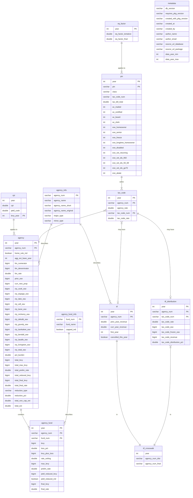
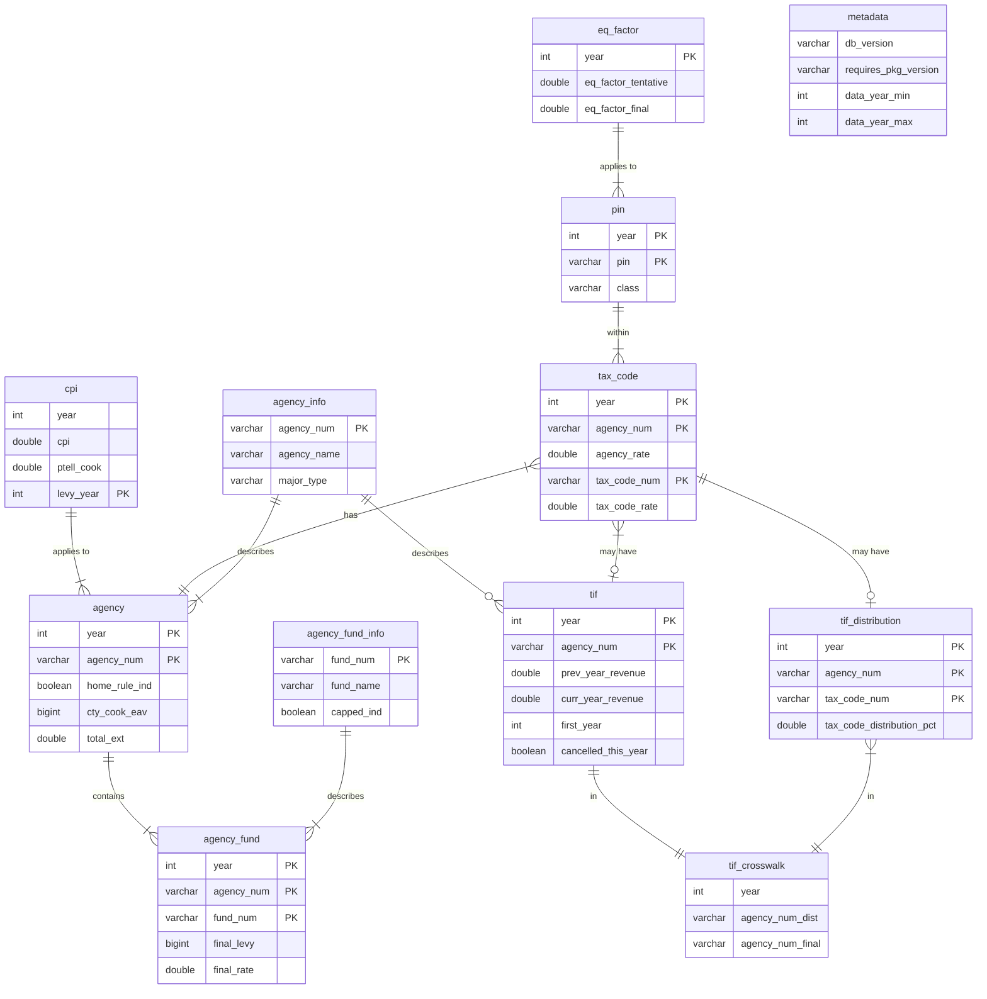

<!-- README.md is generated from README.Rmd. Please edit that file -->

```{r opts, include = FALSE}
knitr::opts_chunk$set(
  collapse = TRUE,
  comment = "#>",
  fig.path = "man/figures/README-",
  out.width = "100%"
)
options(datatable.prettyprint.char = 25L)
```

```{r setup, include = FALSE}
library(ptaxsim)
ptaxsim_db_conn <- DBI::dbConnect(RSQLite::SQLite(), "./ptaxsim.db")

metadata <- DBI::dbGetQuery(ptaxsim_db_conn, "SELECT * FROM metadata")
ptaxsim::check_db_conn(ptaxsim_db_conn)
ptaxsim::check_db_sync(ptaxsim_db_conn)

stopifnot(
  utils::compareVersion(
    metadata$db_version,
    packageDescription("ptaxsim")[["Config/Requires_DB_Version"]]
  ) >= 0
)
```

# PTAXSIM package <a href='https://gitlab.com/ccao-data-science---modeling/packages/ptaxsim'></a>

> :warning: NOTE: PTAXSIM relies on a separate SQLite database to function correctly. You must download and decompress the database before using this package!
> See [Database installation](#database-installation) for details.
>
> [**Link to PTAXSIM database**](`r metadata$source_url_database`) (DB version: `r metadata$db_version`; Last updated: `r metadata$created_at`)

PTAXSIM is an R package/database to approximate Cook County property tax bills. It uses real assessment, exemption, TIF, and levy data to generate historic, line-item tax bills (broken out by taxing district) for any property from `r metadata$data_year_min` to `r metadata$data_year_max`. Given some careful assumptions and data manipulation, it can also provide hypothetical, but factually grounded, answers to questions such as:

* [What would my property tax bill be if my assessed value was $50K lower? What if my school district's levy goes up?](https://ccao-data-science---modeling.gitlab.io/packages/ptaxsim/articles/introduction.html)
* [How do appeals affect tax bills? What if nobody appeals?](https://ccao-data-science---modeling.gitlab.io/packages/ptaxsim/articles/appeals.html)
* [How do exemptions affect tax bills? What if a current exemption amount is increased?](https://ccao-data-science---modeling.gitlab.io/packages/ptaxsim/articles/exemptions.html)
* [How do TIF districts affect tax bills? What if a nearby TIF district did not exist?](https://ccao-data-science---modeling.gitlab.io/packages/ptaxsim/articles/tifs.html)

PTAXSIM can generate hundreds, or even millions, of tax bills in a single function call, which enables complex tax analysis on a municipality or even whole-county level. PTAXSIM is accurate (within $10 of the real bill) for >99% of historic property tax bills. However, it is currently an experimental tool only and is *not* recommended for critical use. See [Notes](#notes) and [Disclaimer](#disclaimer) for more information.

For detailed documentation on included functions and data, [**visit the full reference list**](https://ccao-data-science---modeling.gitlab.io/packages/ptaxsim/reference/) or the [**introduction vignette**](https://ccao-data-science---modeling.gitlab.io/packages/ptaxsim/articles/introduction.html).

For examples of PTAXSIM's functionality and usage, click one of the questions above or see the [**vignettes page**](https://ccao-data-science---modeling.gitlab.io/packages/ptaxsim/articles/index.html).

## Installation

### Package installation

You can install the released version of `ptaxsim` directly from GitLab by running the following R command after installing [remotes](https://github.com/r-lib/remotes):

```{r, eval=FALSE}
remotes::install_gitlab("ccao-data-science---modeling/packages/ptaxsim")
```

Or, using [renv](https://github.com/rstudio/renv/):

```{r, eval=FALSE}
renv::install("gitlab::ccao-data-science---modeling/packages/ptaxsim")
```

#### Installation on Windows

> :warning: NOTE: Windows users may need to install Rtools in order to build and use this package. Please follow the [instructions here](https://cran.r-project.org/bin/windows/Rtools/) to install Rtools for your version of R.

Once Rtools is installed, installation can proceed normally using the code above. Occasionally, when using brand-new or source versions of packages, installation [on Windows fails with the following error](https://github.com/rstudio/renv/issues/162):

```
DLL 'package_name' not found: maybe not installed for this architecture?
```

If this happens, try using the following installation command:

```{r, eval=FALSE}
remotes::install_gitlab(
  repo = "ccao-data-science---modeling/packages/ptaxsim",
  INSTALL_opts = "--no-multiarch"
)
```

### Database installation

PTAXSIM relies on a separate SQLite database to function correctly. This database contains the information about properties, taxing districts, and TIF districts necessary to calculate tax bills. To use this database:

1. Download the compressed database file from the CCAO's public S3 bucket. [Link here](`r metadata$source_url_database`).
2. (Optional) Rename the downloaded database file by removing the version number, i.e. `r paste0("ptaxsim-", metadata$db_version, ".db.bz2")` becomes `ptaxsim.db.bz2`.
3. Decompress the downloaded database file. The file is compressed using [bzip2](https://sourceware.org/bzip2/).
    - On Windows, you can easily decompress bzip2 files using [7-Zip](https://www.7-zip.org/download.html).
    - On *nix systems, bzip2 is typically installed by default and can be used via the command line i.e. `bzip2 -d ptaxsim.db.bz2`. If bzip2 is not installed, use the package manager on your system (brew, apt, etc.) to install it first.
4. Place the decompressed database file (`ptaxsim.db`) in a convenient location, preferably at the root of your R project.
5. At the beginning of your project, instantiate a [DBI](https://dbi.r-dbi.org/) connection to the database file with the name `ptaxsim_db_conn`. The PTAXSIM R functions look for this connection object name by default. If you wish to change the name, you can pass the custom named object to the `conn` argument of each PTAXSIM function. Below is a sample DBI connection:

```{r db_conn, message=FALSE}
library(ptaxsim)

# Create the DB connection with the default name expected by PTAXSIM functions
ptaxsim_db_conn <- DBI::dbConnect(RSQLite::SQLite(), "./ptaxsim.db")
```

## Usage

PTAXSIM has a single primary function - `tax_bill()` - with two required arguments:

1. `year_vec` - A numeric vector of tax years
2. `pin_vec` - A character vector of Property Index Numbers (PINs)

The output is a `data.table` containing the tax amount directed to each taxing district, by PIN and year. By default, `tax_bill()` can only generate *historic* tax bills; it cannot generate future or counterfactual bills. To generate future/counterfactual bills, you must provide additional data to `tax_bill()` via its secondary arguments. See the [introduction page](https://ccao-data-science---modeling.gitlab.io/packages/ptaxsim/articles/introduction.html) for more details.

### Single bill, single year

The simplest use of `tax_bill()` is to calculate a single bill for a single year:

```{r single_bill_1, message=FALSE}
single_bill <- tax_bill(year_vec = 2020, pin_vec = "17341020511001")
single_bill
```

To compare this output to a real tax bill, we can reorder the rows and keep only the columns that appear on an actual printed bill.

```{r single_bill_2, message=FALSE}
library(dplyr)

single_bill %>%
  select(agency_name, final_tax, agency_tax_rate) %>%
  mutate(agency_tax_rate = agency_tax_rate * 100) %>%
  arrange(-row_number()) %>%
  setNames(c("Agency", "2020 Tax", "2020 Rate")) %>%
  knitr::kable("html", digits = 3)
```

Here's the real 2020 tax bill for this PIN for comparison:


There are some minor differences between PTAXSIM and the real bill. The taxing district names may not be identical. Additionally, PTAXSIM aggregates the different Cook County agencies (Public Safety, Health Facilities, and County of Cook) into a single line-item (COUNTY OF COOK).

### Single bill, multiple years

We can also look at a single property over multiple years, in this case broken out by taxing district. To do so, pass a vector of multiple years to the `year_vec` argument of `tax_bill()`:

```{r multi_year_1, message=FALSE, warning=FALSE}
multiple_years <- tax_bill(2010:2021, "14081020210000")
multiple_years
```

The `tax_bill()` function will automatically combine the years and PIN into their Cartesian product. The result is a tax amount per taxing district, per PIN, per year. We can collapse these amounts and then plot them to see how a single PIN has changed over time:

```{r multi_year_2, message=FALSE, warning=FALSE}
multiple_years_summ <- multiple_years %>%
  group_by(year, agency_minor_type) %>%
  summarize(final_tax = sum(final_tax)) %>%
  mutate(
    agency_minor_type = factor(
      agency_minor_type,
      levels = c(
        "TIF", "BOND", "COOK", "LIBRARY",
        "MUNI", "PARK", "UNIFIED", "COMM COLL", "WATER"
      )
    )
  )
```  

<details>

<summary><strong>Click here</strong> to show plot code</summary>

```{r multi_year_3, message=FALSE, warning=FALSE}
library(ggplot2)

# Plot the amount of taxes going to each district over time
multiple_years_plot <- ggplot(data = multiple_years_summ) +
  geom_area(aes(x = year, y = final_tax, fill = agency_minor_type)) +
  geom_vline(xintercept = 2016, linetype = "dashed", alpha = 0.3) +
  annotate(
    "text",
    x = 2015.8,
    y = 12500,
    label = "RPM TIF enacted",
    hjust = 1
  ) +
  scale_y_continuous(
    name = "Total Tax Amount",
    labels = scales::dollar,
    expand = c(0, 0)
  ) +
  scale_x_continuous(name = "Year", n.breaks = 7) +
  scale_fill_manual(values = scales::hue_pal()(9)) +
  theme_minimal() +
  guides(fill = guide_legend(title = "District Type"))
```

</details>

```{r multi_year_4, message=FALSE, warning=FALSE, echo=FALSE}
multiple_years_plot
```

For more advanced usage, such as counterfactual analysis, see the [vignettes page](https://ccao-data-science---modeling.gitlab.io/packages/ptaxsim/articles/index.html).

# Data

The PTAXSIM backend database contains cleaned data from the Cook County Clerk, Treasurer, and Assessor. The database is updated whenever all the data necessary to calculate a new tax year becomes available. Typically this occurs roughly a year after assessments are mailed i.e. 2019 bill data was available in mid-2020.

## Data sources

| Table Name       | Source Agency     | Source Link                                                                                                                                          | Ingest Script                                                    | Contains                                                          |
|------------------|-------------------|------------------------------------------------------------------------------------------------------------------------------------------------------|------------------------------------------------------------------|-------------------------------------------------------------------|
| agency           | Clerk             | [Tax Extension - Agency Tax Rate Reports](https://www.cookcountyclerkil.gov/property-taxes/tax-extension-and-rates)                                  | [data-raw/agency/agency.R](data-raw/agency/agency.R)             | Taxing district extensions, limits, and base EAV                  |
| agency_info      | Clerk + imputed   | [Tax Extension - Agency Tax Rate Reports](https://www.cookcountyclerkil.gov/property-taxes/tax-extension-and-rates)                                  | [data-raw/agency/agency.R](data-raw/agency/agency.R)             | Taxing district name, type, and subtype                           |
| agency_fund      | Clerk             | [Tax Extension - Agency Tax Rate Reports](https://www.cookcountyclerkil.gov/property-taxes/tax-extension-and-rates)                                  | [data-raw/agency/agency.R](data-raw/agency/agency.R)             | Funds and line-items that contribute to each district's extension |
| agency_fund_info | Clerk             | [Tax Extension - Agency Tax Rate Reports](https://www.cookcountyclerkil.gov/property-taxes/tax-extension-and-rates)                                  | [data-raw/agency/agency.R](data-raw/agency/agency.R)             | Fund name and whether the fund is statutorily capped              |
| cpi              | IDOR              | [History of CPI's Used for the PTELL](https://www2.illinois.gov/rev/localgovernments/property/Documents/cpihistory.pdf)                              | [data-raw/cpi/cpi.R](data-raw/cpi/cpi.R)                         | CPI-U used to calculate PTELL limits                              |
| eq_factor        | Clerk             | [Tax Extension - Agency Tax Rate Reports](https://www.cookcountyclerkil.gov/property-taxes/tax-extension-and-rates)                                  | [data-raw/eq_factor/eq_factor.R](data-raw/eq_factor/eq_factor.R) | Equalization factor applied to AV to get EAV                      |
| pin              | Clerk + Treasurer | CLERKVALUES and TAXBILLAMOUNTS internal SQL tables                                                                                                   | [data-raw/pin/pin.R](data-raw/pin/pin.R)                         | PIN-level tax code, AV, and exemptions                            |
| tax_code         | Clerk             | [Tax Extension - Tax Code Agency Rate Reports](https://www.cookcountyclerkil.gov/property-taxes/tax-extension-and-rates)                             | [data-raw/tax_code/tax_code.R](data-raw/tax_code/tax_code.R)     | Crosswalk of tax codes by district                                |
| tif              | Clerk             | [TIF Reports - Cook County Summary Reports](https://www.cookcountyclerkil.gov/property-taxes/tifs-tax-increment-financing/tif-reports)               | [data-raw/tif/tif.R](data-raw/tif/tif.R)                         | TIF revenue, start year, and cancellation year                    |
| tif_distribution | Clerk             | [TIF Reports - Tax Increment Agency Distribution Reports](https://www.cookcountyclerkil.gov/property-taxes/tifs-tax-increment-financing/tif-reports) | [data-raw/tif/tif.R](data-raw/tif/tif.R)                         | TIF EAV, frozen EAV, and distribution percentage by tax code      |

## Database diagram 

<details>

<summary><strong>Click here</strong> to show full database diagram</summary>



</details>



# Notes and Caveats

- Currently, the per-district tax calculations for properties in the Red-Purple Modernization (RPM) TIF are slightly flawed. However, the total tax bill per PIN is still accurate. See issue [#11](#11) for more information.
- Special Service Area (SSA) rates must be calculated manually when creating counterfactual bills. See issue [#31](#31) for more information.
- In rare instances, a TIF can have multiple `agency_num` identifiers (usually there's only one per TIF). The `tif_crosswalk` table determines what the "main" `agency_num` is for each TIF and pulls the name and TIF information using that identifier. See issue [#39](#39) for more information.
- PTAXSIM is a currently a developer and researcher-focused package. It is not intended to predict or explain individual bills. In the future, we plan to make PTAXSIM more accessible via a web frontend and/or API.
- PTAXSIM is relatively memory-efficient and can calculate every district line-item for every tax bill for the last 15 years (roughly 350 million rows). However, the memory required for this calculation is substantial (around 100 GB).
- PTAXSIM's accuracy is measured automatically with an [integration test](tests/testthat/test-accuracy.R). The test takes a random sample of 2 million PINs, calculates the total bill for each PIN, and compares it to the real total bill.

# Disclaimer

This package and the included database are for educational purposes only. The Assessor's office releases the package and database without any representations or warranties of any kind, whether express or implied. Any data, figures, or amounts contained within the package/database, used by the package/database, or produced by the package are solely for illustrative purposes.

Any results produced by this package as distributed are not official, as they are hypothetical, and should not be relied upon for any business or commercial purpose. The Assessor's office expressly disclaims any liability for any entity's reliance on this package and/or database.
