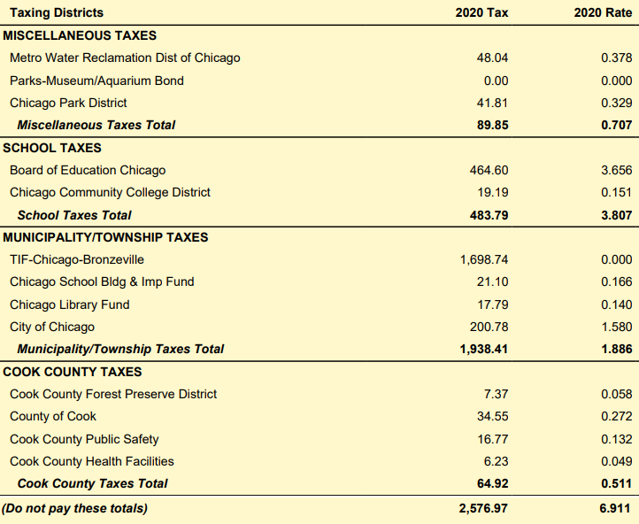
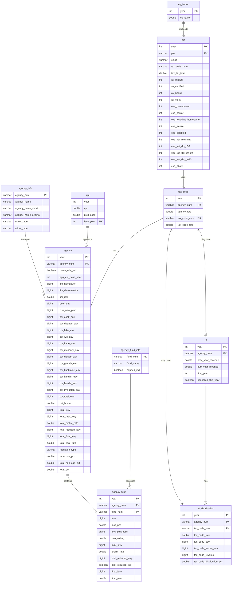
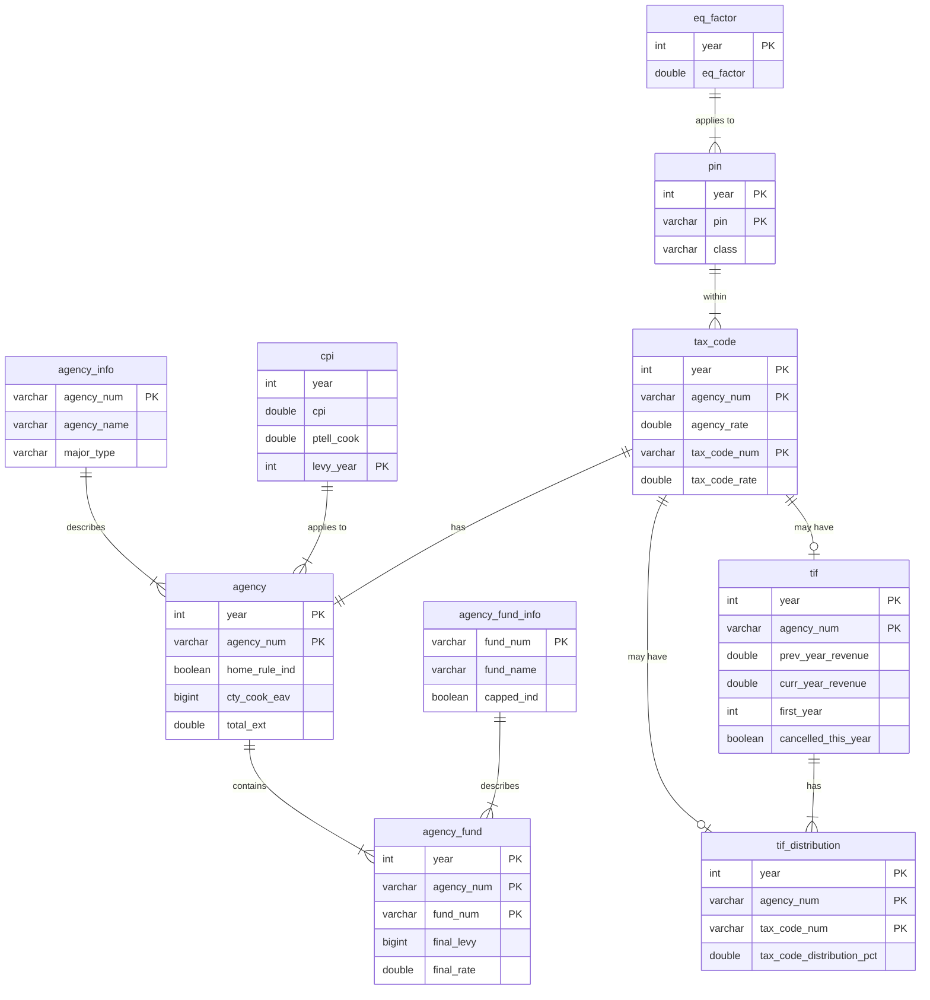

<!-- README.md is generated from README.Rmd. Please edit that file -->

# PTAXSIM package <a href='https://gitlab.com/ccao-data-science---modeling/packages/ptaxsim'></a>

> :warning: NOTE: PTAXSIM relies on a separate SQLite database to
> function correctly. You must download and decompress the database
> before using this package! See [Database
> installation](#database-installation) for details.
>
> [**Link to PTAXSIM
> database**](https://ccao-data-public-us-east-1.s3.amazonaws.com/ptaxsim/ptaxsim.db.zst)

PTAXSIM is an R package/database to approximate Cook County property tax
bills. It uses real assessment, exemption, TIF, and levy data to
generate historic, line-item tax bills (broken out by taxing district)
for any property from 2006 to 2020. Given some careful assumptions and
data manipulation, it can also answer questions such as:

-   What would my property tax bill be if my assessed value was $50K
    lower? What if I received a new exemption?
-   How have tax bills changed in my area? Where does my tax money
    actually go?
-   How do exemptions affect my tax bill? What if a current exemption
    amount is increased?
-   How do TIF districts affect my tax bill? What if TIF districts did
    not exist?

PTAXSIM can generate hundreds, or even millions, of tax bills in a
single function call, which enables complex tax analysis on a
municipality or even county level. PTAXSIM is accurate (within $10 of
the real bill) for \>99% of historic property tax bills. However, it is
currently an experimental tool only and is *not* recommended for
critical use. See [Notes](#notes) and [Disclaimer](#disclaimer) for more
information.

For detailed documentation on included functions and data, [**visit the
full reference
list**](https://ccao-data-science---modeling.gitlab.io/packages/ptaxsim/reference/).

For examples of PTAXSIM’s functionality and usage, click one of the
questions above or see the [**vignettes
page**](https://ccao-data-science---modeling.gitlab.io/packages/ptaxsim/articles/index.html).

## Installation

### Package installation

You can install the released version of `ptaxsim` directly from GitLab
by running the following R command after installing
[remotes](https://github.com/r-lib/remotes):

``` r
remotes::install_gitlab("ccao-data-science---modeling/packages/ptaxsim")
```

Occasionally, when using brand-new or source versions of packages,
installation [on Windows fails with the following
error](https://github.com/rstudio/renv/issues/162):

    DLL 'package_name' not found: maybe not installed for this architecture?

If this happens, try using the following installation command:

``` r
remotes::install_gitlab(
  repo = "ccao-data-science---modeling/packages/ptaxsim",
  INSTALL_opts = "--no-multiarch"
)
```

### Database installation

PTAXSIM relies on a separate SQLite database to function correctly. This
database contains information about properties, taxing districts, and
TIF districts necessary to calculate tax bills. To use this database:

1.  Download the compressed database file from the CCAO’s public S3
    bucket. [Link
    here](https://ccao-data-public-us-east-1.s3.amazonaws.com/ptaxsim/ptaxsim.db.zst).
2.  Decompress the downloaded database file. The file is compressed
    using [zstd](https://github.com/facebook/zstd), which needs to be
    installed separately.
3.  Place the decompressed database file in a convenient location,
    preferably at the root of your R project.
4.  At the beginning of your project, instantiate a
    [DBI](https://dbi.r-dbi.org/) connection to the database file with
    the name `ptaxsim_db_conn`. The PTAXSIM R functions look for this
    connection object name by default. If you wish to change the name,
    you can pass the custom named object to the `conn` argument of each
    PTAXSIM function. Below is a sample DBI connection:

``` r
library(dplyr)
library(ptaxsim)

# Create the DB connection with the default name expected by PTAXSIM functions
ptaxsim_db_conn <- DBI::dbConnect(RSQLite::SQLite(), "./ptaxsim.db")
```

## Usage

PTAXSIM has a single primary function - `tax_bill()` - with two main
arguments:

1.  `year_vec` - A numeric vector of tax years
2.  `pin_vec` - A character vector of Property Index Numbers (PINs)

The output is a data frame containing the tax amount directed to each
taxing district, by PIN and year. By default, `tax_bill()` can only
generate *historic* tax bills; it cannot generate future or
counterfactual bills. To generate future/counterfactual bills, you must
provide additional data to `tax_bill()` via its secondary arguments. See
the [vignettes
page](https://ccao-data-science---modeling.gitlab.io/packages/ptaxsim/articles/index.html)
for more details.

### Single bill, single year

The simplest use of `tax_bill()` is to calculate a single bill for a
single year:

``` r
single_bill <- tax_bill(year_vec = 2020, pin_vec = "17341020511001")
single_bill
#>     year            pin class tax_code    av   eav agency_num
#>  1: 2020 17341020511001   299    76037 11568 37288  010010000
#>  2: 2020 17341020511001   299    76037 11568 37288  010020000
#>  3: 2020 17341020511001   299    76037 11568 37288  030210000
#>  4: 2020 17341020511001   299    76037 11568 37288  030210001
#>  5: 2020 17341020511001   299    76037 11568 37288  030210002
#>  6: 2020 17341020511001   299    76037 11568 37288  030210529
#>  7: 2020 17341020511001   299    76037 11568 37288  043030000
#>  8: 2020 17341020511001   299    76037 11568 37288  044060000
#>  9: 2020 17341020511001   299    76037 11568 37288  050200000
#> 10: 2020 17341020511001   299    76037 11568 37288  050200001
#> 11: 2020 17341020511001   299    76037 11568 37288  080180000
#>                                             agency_name     agency_major_type
#>  1:                                      COUNTY OF COOK           COOK COUNTY
#>  2:             FOREST PRESERVE DISTRICT OF COOK COUNTY           COOK COUNTY
#>  3:                                     CITY OF CHICAGO MUNICIPALITY/TOWNSHIP
#>  4:                        CITY OF CHICAGO LIBRARY FUND MUNICIPALITY/TOWNSHIP
#>  5:              CITY OF CHICAGO SCHOOL BLDG & IMP FUND MUNICIPALITY/TOWNSHIP
#>  6:                         TIF - CHICAGO - BRONZEVILLE MUNICIPALITY/TOWNSHIP
#>  7:              CHICAGO COMMUNITY COLLEGE DISTRICT 508                SCHOOL
#>  8:                                  BOARD OF EDUCATION                SCHOOL
#>  9:                               CHICAGO PARK DISTRICT         MISCELLANEOUS
#> 10:       CHICAGO PARK DISTRICT AQUARIUM & MUSEUM BONDS         MISCELLANEOUS
#> 11: METRO WATER RECLAMATION DISTRICT OF GREATER CHICAGO         MISCELLANEOUS
#>     agency_minor_type agency_tax_rate final_tax
#>  1:              COOK         0.00453     57.57
#>  2:              COOK         0.00058      7.37
#>  3:              MUNI         0.01580    200.79
#>  4:           LIBRARY         0.00140     17.79
#>  5:              MUNI         0.00166     21.10
#>  6:               TIF         0.00000   1698.69
#>  7:            SCHOOL         0.00151     19.19
#>  8:            SCHOOL         0.03656    464.62
#>  9:              PARK         0.00329     41.81
#> 10:              BOND         0.00000      0.00
#> 11:             WATER         0.00378     48.04
```

To compare this output to a real tax bill, we can reorder the rows and
keep only the columns that appear on an actual printed bill.

``` r
single_bill %>%
  select(agency_name, final_tax, agency_tax_rate) %>%
  mutate(agency_tax_rate = agency_tax_rate * 100) %>%
  arrange(-row_number()) %>%
  setNames(c("Agency", "2020 Tax", "2020 Rate")) %>%
  knitr::kable("html", digits = 3)
```

<table>
<thead>
<tr>
<th style="text-align:left;">
Agency
</th>
<th style="text-align:right;">
2020 Tax
</th>
<th style="text-align:right;">
2020 Rate
</th>
</tr>
</thead>
<tbody>
<tr>
<td style="text-align:left;">
METRO WATER RECLAMATION DISTRICT OF GREATER CHICAGO
</td>
<td style="text-align:right;">
48.04
</td>
<td style="text-align:right;">
0.378
</td>
</tr>
<tr>
<td style="text-align:left;">
CHICAGO PARK DISTRICT AQUARIUM & MUSEUM BONDS
</td>
<td style="text-align:right;">
0.00
</td>
<td style="text-align:right;">
0.000
</td>
</tr>
<tr>
<td style="text-align:left;">
CHICAGO PARK DISTRICT
</td>
<td style="text-align:right;">
41.81
</td>
<td style="text-align:right;">
0.329
</td>
</tr>
<tr>
<td style="text-align:left;">
BOARD OF EDUCATION
</td>
<td style="text-align:right;">
464.62
</td>
<td style="text-align:right;">
3.656
</td>
</tr>
<tr>
<td style="text-align:left;">
CHICAGO COMMUNITY COLLEGE DISTRICT 508
</td>
<td style="text-align:right;">
19.19
</td>
<td style="text-align:right;">
0.151
</td>
</tr>
<tr>
<td style="text-align:left;">
TIF - CHICAGO - BRONZEVILLE
</td>
<td style="text-align:right;">
1698.69
</td>
<td style="text-align:right;">
0.000
</td>
</tr>
<tr>
<td style="text-align:left;">
CITY OF CHICAGO SCHOOL BLDG & IMP FUND
</td>
<td style="text-align:right;">
21.10
</td>
<td style="text-align:right;">
0.166
</td>
</tr>
<tr>
<td style="text-align:left;">
CITY OF CHICAGO LIBRARY FUND
</td>
<td style="text-align:right;">
17.79
</td>
<td style="text-align:right;">
0.140
</td>
</tr>
<tr>
<td style="text-align:left;">
CITY OF CHICAGO
</td>
<td style="text-align:right;">
200.79
</td>
<td style="text-align:right;">
1.580
</td>
</tr>
<tr>
<td style="text-align:left;">
FOREST PRESERVE DISTRICT OF COOK COUNTY
</td>
<td style="text-align:right;">
7.37
</td>
<td style="text-align:right;">
0.058
</td>
</tr>
<tr>
<td style="text-align:left;">
COUNTY OF COOK
</td>
<td style="text-align:right;">
57.57
</td>
<td style="text-align:right;">
0.453
</td>
</tr>
</tbody>
</table>

Here’s the real 2020 tax bill for this PIN for comparison:



There are some minor differences between PTAXSIM and the real bill. The
taxing district names may not be identical. Additionally, PTAXSIM
aggregates the different Cook County agencies (Public Safety, Health
Facilities, and County of Cook) into a single line-item (COUNTY OF
COOK).

### Single bill, multiple years

We can also look at a single property over multiple years, in this case
broken out by taxing district. To do so, pass a vector of multiple years
to the `year_vec` argument of `tax_bill()`:

``` r
multiple_years <- tax_bill(2010:2020, "14081020210000")
multiple_years
#>      year            pin class tax_code    av    eav agency_num
#>   1: 2010 14081020210000   206    73001 69062 227905  010010000
#>   2: 2010 14081020210000   206    73001 69062 227905  010020000
#>   3: 2010 14081020210000   206    73001 69062 227905  030210000
#>   4: 2010 14081020210000   206    73001 69062 227905  030210001
#>   5: 2010 14081020210000   206    73001 69062 227905  030210002
#>  ---                                                           
#> 111: 2020 14081020210000   206    73105 61605 198578  043030000
#> 112: 2020 14081020210000   206    73105 61605 198578  044060000
#> 113: 2020 14081020210000   206    73105 61605 198578  050200000
#> 114: 2020 14081020210000   206    73105 61605 198578  050200001
#> 115: 2020 14081020210000   206    73105 61605 198578  080180000
#>                                              agency_name     agency_major_type
#>   1:                                      COUNTY OF COOK           COOK COUNTY
#>   2:             FOREST PRESERVE DISTRICT OF COOK COUNTY           COOK COUNTY
#>   3:                                     CITY OF CHICAGO MUNICIPALITY/TOWNSHIP
#>   4:                        CITY OF CHICAGO LIBRARY FUND MUNICIPALITY/TOWNSHIP
#>   5:              CITY OF CHICAGO SCHOOL BLDG & IMP FUND MUNICIPALITY/TOWNSHIP
#>  ---                                                                          
#> 111:              CHICAGO COMMUNITY COLLEGE DISTRICT 508                SCHOOL
#> 112:                                  BOARD OF EDUCATION                SCHOOL
#> 113:                               CHICAGO PARK DISTRICT         MISCELLANEOUS
#> 114:       CHICAGO PARK DISTRICT AQUARIUM & MUSEUM BONDS         MISCELLANEOUS
#> 115: METRO WATER RECLAMATION DISTRICT OF GREATER CHICAGO         MISCELLANEOUS
#>      agency_minor_type agency_tax_rate final_tax
#>   1:              COOK         0.00423    964.04
#>   2:              COOK         0.00051    116.23
#>   3:              MUNI         0.00914   2083.05
#>   4:           LIBRARY         0.00102    232.46
#>   5:              MUNI         0.00116    264.37
#>  ---                                            
#> 111:            SCHOOL         0.00151    240.64
#> 112:            SCHOOL         0.03656   5468.12
#> 113:              PARK         0.00329    524.32
#> 114:              BOND         0.00000      0.00
#> 115:             WATER         0.00378    602.41
```

The `tax_bill()` function will automatically combine the years and PIN
into their Cartesian product. The result is a tax amount per taxing
district, per PIN, per year. We can collapse these amounts and then plot
them to see how a single PIN has changed over time:

``` r
multiple_years_summ <- multiple_years %>%
  group_by(year, agency_minor_type) %>%
  summarize(final_tax = sum(final_tax)) %>%
  mutate(
    agency_minor_type = factor(
      agency_minor_type,
      levels = c(
        "TIF", "BOND", "COOK", "LIBRARY",
        "MUNI", "PARK", "SCHOOL", "WATER"
      )
    )
  )
```

<details>
<summary>
<strong>Click here</strong> to show plot code
</summary>

``` r
library(ggplot2)

# Plot the amount of taxes going to each district over time
multiple_years_plot <- ggplot(data = multiple_years_summ) +
  geom_area(aes(x = year, y = final_tax, fill = agency_minor_type)) +
  geom_vline(xintercept = 2016, linetype = "dashed", alpha = 0.3) +
  annotate(
    "text",
    x = 2015.8,
    y = 12500,
    label = "RPM TIF enacted",
    hjust = 1
  ) +
  scale_y_continuous(
    name = "Total Tax Amount",
    labels = scales::dollar,
    expand = c(0, 0)
  ) +
  scale_x_continuous(name = "Year", n.breaks = 7) +
  scale_fill_manual(values = scales::hue_pal()(8)) +
  theme_minimal() +
  guides(fill = guide_legend(title = "District Type"))
```

</details>


For more advanced usage, such as counterfactual analysis, see the
[vignettes
page](https://ccao-data-science---modeling.gitlab.io/packages/ptaxsim/articles/index.html).

# Data

The PTAXSIM backend database contains cleaned data from the Cook County
Clerk, Treasurer, and Assessor. The database is updated whenever all the
data necessary to calculate a new tax year becomes available. Typically
this occurs roughly a year after assessments are mailed i.e. 2019 bill
data was available in mid-2020.

## Data sources

| Table Name       | Source Agency     | Source Link                                                                                                                                          | Ingest Script                                                    | Contains                                                          |
|------------------|-------------------|------------------------------------------------------------------------------------------------------------------------------------------------------|------------------------------------------------------------------|-------------------------------------------------------------------|
| agency           | Clerk             | [Tax Extension - Agency Tax Rate Reports](https://www.cookcountyclerkil.gov/property-taxes/tax-extension-and-rates)                                  | [data-raw/agency/agency.R](data-raw/agency/agency.R)             | Taxing district extensions, limits, and base EAV                  |
| agency_info      | Clerk + imputed   | [Tax Extension - Agency Tax Rate Reports](https://www.cookcountyclerkil.gov/property-taxes/tax-extension-and-rates)                                  | [data-raw/agency/agency.R](data-raw/agency/agency.R)             | Taxing district name, type, and subtype                           |
| agency_fund      | Clerk             | [Tax Extension - Agency Tax Rate Reports](https://www.cookcountyclerkil.gov/property-taxes/tax-extension-and-rates)                                  | [data-raw/agency/agency.R](data-raw/agency/agency.R)             | Funds and line-items that contribute to each district’s extension |
| agency_fund_info | Clerk             | [Tax Extension - Agency Tax Rate Reports](https://www.cookcountyclerkil.gov/property-taxes/tax-extension-and-rates)                                  | [data-raw/agency/agency.R](data-raw/agency/agency.R)             | Fund name and whether the fund is statutorily capped              |
| cpi              | IDOR              | [History of CPI’s Used for the PTELL](https://www2.illinois.gov/rev/localgovernments/property/Documents/cpihistory.pdf)                              | [data-raw/cpi/cpi.R](data-raw/cpi/cpi.R)                         | CPI-U used to calculate PTELL limits                              |
| eq_factor        | Clerk             | [Tax Extension - Agency Tax Rate Reports](https://www.cookcountyclerkil.gov/property-taxes/tax-extension-and-rates)                                  | [data-raw/eq_factor/eq_factor.R](data-raw/eq_factor/eq_factor.R) | Equalization factor applied to AV to get EAV                      |
| pin              | Clerk + Treasurer | CLERKVALUES and TAXBILLAMOUNTS internal SQL tables                                                                                                   | [data-raw/pin/pin.R](data-raw/pin/pin.R)                         | PIN-level tax code, AV, and exemptions                            |
| tax_code         | Clerk             | [Tax Extension - Tax Code Agency Rate Reports](https://www.cookcountyclerkil.gov/property-taxes/tax-extension-and-rates)                             | [data-raw/tax_code/tax_code.R](data-raw/tax_code/tax_code.R)     | Crosswalk of tax codes by district                                |
| tif              | Clerk             | [TIF Reports - Cook County Summary Reports](https://www.cookcountyclerkil.gov/property-taxes/tifs-tax-increment-financing/tif-reports)               | [data-raw/tif/tif.R](data-raw/tif/tif.R)                         | TIF revenue, start year, and cancellation year                    |
| tif_distribution | Clerk             | [TIF Reports - Tax Increment Agency Distribution Reports](https://www.cookcountyclerkil.gov/property-taxes/tifs-tax-increment-financing/tif-reports) | [data-raw/tif/tif.R](data-raw/tif/tif.R)                         | TIF EAV, frozen EAV, and distribution percentage by tax code      |

## Database diagram

<details>
<summary>
<strong>Click here</strong> to show full database diagram
</summary>



</details>



# Notes

-   Currently, the per-district tax calculations for properties in the
    RPM TIF are slightly flawed. However, the total tax bill per PIN is
    still accurate. See issue \#11 for more information.
-   PTAXSIM is a currently a developer and researcher-focused package.
    It is not intended to predict or explain individual bills. In the
    future, we plan to make PTAXSIM more accessible via a web frontend
    and API.
-   PTAXSIM is relatively memory-efficient and can calculate every
    district line-item for every tax bill for the last 15 years (roughly
    350 million rows). However, the memory requirements for this
    calculation are substantial (around 100 GB).
-   PTAXSIM’s accuracy is measured automatically with an [integration
    test](tests/testthat/test-accuracy.R). The test takes a random
    sample of 10,000 PINs from each year, calculates the total bill for
    each PIN, and compares it to the real total bill. The most common
    source of inaccuracy is tax refunds (e.g. overpaying a previous
    bill).

# Disclaimer

This package and the included database are for educational purposes
only. The Assessor’s office releases the package and database without
any representations or warranties of any kind, whether express or
implied. Any data, figures, or amounts contained within the
package/database, used by the package/database, or produced by the
package are solely for illustrative purposes.

Any results produced by this package as distributed are not official and
should not be relied upon for any business or commercial purpose. They
merely demonstrate the package’s features. The Assessor’s office
expressly disclaims any liability for any entity’s reliance on this
package and/or database.
