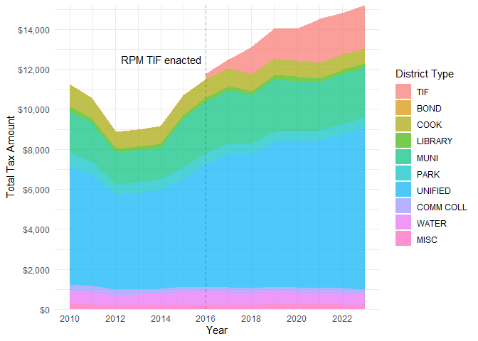

Table of Contents
================

- <a href="#ptaxsim-package" id="toc-ptaxsim-package">PTAXSIM package</a>
- <a href="#faqs" id="toc-faqs">FAQs</a>
- <a href="#installation" id="toc-installation">Installation</a>
  - <a href="#package-installation" id="toc-package-installation">Package
    installation</a>
  - <a href="#database-installation" id="toc-database-installation">Database
    installation</a>
- <a href="#usage" id="toc-usage">Usage</a>
  - <a href="#single-bill-single-year"
    id="toc-single-bill-single-year">Single bill, single year</a>
  - <a href="#single-bill-multiple-years"
    id="toc-single-bill-multiple-years">Single bill, multiple years</a>
- <a href="#data" id="toc-data">Data</a>
  - <a href="#data-sources" id="toc-data-sources">Data sources</a>
  - <a href="#database-diagram" id="toc-database-diagram">Database
    diagram</a>
- <a href="#notes-and-caveats" id="toc-notes-and-caveats">Notes and
  caveats</a>
- <a href="#disclaimer" id="toc-disclaimer">Disclaimer</a>
- <a href="#release-procedures" id="toc-release-procedures">Release
  procedures</a>
  - <a href="#schema" id="toc-schema">Schema</a>
  - <a href="#timing" id="toc-timing">Timing</a>
  - <a href="#checklists" id="toc-checklists">Checklists</a>

<!-- README.md is generated from README.Rmd. Please edit that file -->

## PTAXSIM package

<a href='https://gitlab.com/ccao-data-science---modeling/packages/ptaxsim'></a>

> :warning: NOTE: PTAXSIM relies on a separate SQLite database to
> function correctly. You must download and decompress the database
> before using this package! See [Database
> installation](#database-installation) for details.
>
> [**Link to PTAXSIM
> database**](https://ccao-data-public-us-east-1.s3.amazonaws.com/ptaxsim/ptaxsim-2021.0.4.db.bz2)
> (DB version: 2021.0.4; Last updated: 2023-04-28 23:40:05)

PTAXSIM is an R package/database to approximate Cook County property tax
bills. It uses real assessment, exemption, TIF, and levy data to
generate historic, line-item tax bills (broken out by taxing district)
for any property from 2006 to 2021. Given some careful assumptions and
data manipulation, it can also provide hypothetical, but factually
grounded, answers to questions such as:

- [What would my property tax bill be if my assessed value was \$50K
  lower? What if my school district’s levy goes
  up?](https://ccao-data-science---modeling.gitlab.io/packages/ptaxsim/articles/introduction.html)
- [How do appeals affect tax bills? What if nobody
  appeals?](https://ccao-data-science---modeling.gitlab.io/packages/ptaxsim/articles/appeals.html)
- [How do exemptions affect tax bills? What if a current exemption
  amount is
  increased?](https://ccao-data-science---modeling.gitlab.io/packages/ptaxsim/articles/exemptions.html)
- [How do TIF districts affect tax bills? What if a nearby TIF district
  did not
  exist?](https://ccao-data-science---modeling.gitlab.io/packages/ptaxsim/articles/tifs.html)

PTAXSIM can generate hundreds, or even millions, of tax bills in a
single function call, which enables complex tax analysis on a
municipality or even whole-county level. PTAXSIM is accurate (within
\$10 of the real bill) for \>99% of historic property tax bills.
However, it is currently an experimental tool only and is *not*
recommended for critical use. See [Notes](#notes-and-caveats) and
[Disclaimer](#disclaimer) for more information.

For detailed documentation on included functions and data, [**visit the
full reference
list**](https://ccao-data-science---modeling.gitlab.io/packages/ptaxsim/reference/)
or the [**introduction
vignette**](https://ccao-data-science---modeling.gitlab.io/packages/ptaxsim/articles/introduction.html).

For examples of PTAXSIM’s functionality and usage, click one of the
questions above or see the [**vignettes
page**](https://ccao-data-science---modeling.gitlab.io/packages/ptaxsim/articles/index.html).

## FAQs

**Q: Who is the target audience for PTAXSIM?**

PTAXSIM is a currently a developer and researcher-focused tool. Its
intended audience is academics and policymakers interested in tax policy
analysis or the history of the property tax system. It is not intended
to predict or explain individual bills. In the future, we plan to make
PTAXSIM more accessible via a web frontend and/or API.

**Q: I got my Assessment Notice with a *new* assessed value. Can I input
the *new* assessed value into PTAXSIM to predict next year’s property
tax bill?**

*No.* Assessments sent by the Assessor are not final. A property’s
assessed value can change at multiple stages: at the Assessor’s Office
due to a reassessment, at the Assessor’s Office due to an appeal, and at
the Board of Review due to an appeal. Assessments are not finalized
until these stages are complete/certified, and only finalized
assessments are used to calculate bills.

Additionally, an increased assessed value does not necessarily result in
an increased bill. There are many other factors that contribute to a
property’s tax bill – including the assessed value of other properties.

**Q: I know my property’s *final* assessed value. Can I input the
*final* assessed value into PTAXSIM to predict next year’s property tax
bill?**

*No.* Even if you know your property’s final assessed value with
certainty, precisely predicting a future tax bill in Cook County is
difficult because tax rates stem from multiple agencies (and the numbers
they produce each year). These agencies include various taxing districts
(typically 10 to 14 per property, including school districts,
municipal/township/city governments, and Cook County), multiple Cook
County property tax offices (Assessor, Board of Review, and Clerk), and
the Illinois Department of Revenue (IDOR).

It is true, however, that PTAXSIM is technically capable of predicting
bills. To do this, you must have technical competency in the R
programming language, and must make explicit predictions for each of the
numeric inputs listed in the table below.

**Q: I can code in R. What other numbers, besides assessed value, do I
need to input into PTAXSIM to generate predictions?**

To predict next year’s bill for one property (PIN), you must predict the
PIN’s taxable value (EAV), as well as what will happen to the individual
levies and tax bases of all taxing districts associated with the PIN.
The table below lists each input, along with some complications and
options:

|                                                             Input                                                              |                                                                               What this means                                                                                |                                                                                                                                                                                                            Complications and possible implementation option(s)                                                                                                                                                                                                             |
|:------------------------------------------------------------------------------------------------------------------------------:|:----------------------------------------------------------------------------------------------------------------------------------------------------------------------------:|:--------------------------------------------------------------------------------------------------------------------------------------------------------------------------------------------------------------------------------------------------------------------------------------------------------------------------------------------------------------------------------------------------------------------------------------------------------------------------:|
|                                                  The PIN’s **taxable value**                                                   |                              The PIN’s Equalized Assessed Value (EAV), which incorporates the assessed value, exemptions, and IDOR’s equalizer.                              |                                                                                     *Complications*: In a tax year, AVs can change at the Assessor’s Office and at the Board of Review. Also, IDOR calculates a new equalizer every year. <br><br> *Option*: Predict what you think is an accurate AV, apply what exemptions you qualify for, and use past equalizers issued by IDOR.                                                                                      |
| **Tax extensions**, also called levies, for each taxing agency associated with that PIN’s tax code (typically, 10-14 agencies) |               The total extension is the total dollar amount each taxing agency decides to collect from property owners within the boundaries of its district.               |                                                                                                                              *Complication*: Each agency sets their own tax levy. <br><br> *Option*: For each agency associated with that PIN’s tax code, you might use the past year extension, and apply a percentage increase or decrease.                                                                                                                              |
|              **Tax bases** for each taxing agency associated with that PIN’s tax code (typically, 10-14 agencies)              | For each agency, the tax base equals the sum of the EAVs of all properties in its district, except for any region of the agency that is in a TIF (where the base is frozen). | *Complication*: Even after a township has been reassessed, many agencies span across township boundaries. (For example: the taxing district of the City of Chicago is divided up into eight assessment townships, but property tax bills for Chicagoans depend on assessments throughout all eight townships). <br><br> *Option*: For each agency associated with that PIN’s tax code, you might use the past year total EAV, and apply a percentage increase or decrease. |

## Installation

### Package installation

You can install the released version of `ptaxsim` directly from GitLab
by running the following R command after installing
[remotes](https://github.com/r-lib/remotes):

``` r
remotes::install_gitlab("ccao-data-science---modeling/packages/ptaxsim")
```

Or, using [renv](https://github.com/rstudio/renv/):

``` r
renv::install("gitlab::ccao-data-science---modeling/packages/ptaxsim")
```

#### Installation on Windows

> :warning: NOTE: Windows users may need to install Rtools in order to
> build and use this package. Please follow the [instructions
> here](https://cran.r-project.org/bin/windows/Rtools/) to install
> Rtools for your version of R.

Once Rtools is installed, installation can proceed normally using the
code above. Occasionally, when using brand-new or source versions of
packages, installation [on Windows fails with the following
error](https://github.com/rstudio/renv/issues/162):

    DLL 'package_name' not found: maybe not installed for this architecture?

If this happens, try using the following installation command:

``` r
remotes::install_gitlab(
  repo = "ccao-data-science---modeling/packages/ptaxsim",
  INSTALL_opts = "--no-multiarch"
)
```

### Database installation

PTAXSIM relies on a separate SQLite database to function correctly. This
database contains the information about properties, taxing districts,
and TIF districts necessary to calculate tax bills. To use this
database:

1.  Download the compressed database file from the CCAO’s public S3
    bucket. [Link
    here](https://ccao-data-public-us-east-1.s3.amazonaws.com/ptaxsim/ptaxsim-2021.0.4.db.bz2).
2.  (Optional) Rename the downloaded database file by removing the
    version number, i.e. ptaxsim-2021.0.4.db.bz2 becomes
    `ptaxsim.db.bz2`.
3.  Decompress the downloaded database file. The file is compressed
    using [bzip2](https://sourceware.org/bzip2/).
    - On Windows, you can easily decompress bzip2 files using
      [7-Zip](https://www.7-zip.org/download.html).
    - On \*nix systems, bzip2 is typically installed by default and can
      be used via the command line i.e. `bzip2 -d ptaxsim.db.bz2`. If
      bzip2 is not installed, use the package manager on your system
      (brew, apt, etc.) to install it first.
4.  Place the decompressed database file (`ptaxsim.db`) in a convenient
    location, preferably at the root of your R project.
5.  At the beginning of your project, instantiate a
    [DBI](https://dbi.r-dbi.org/) connection to the database file with
    the name `ptaxsim_db_conn`. The PTAXSIM R functions look for this
    connection object name by default. If you wish to change the name,
    you can pass the custom named object to the `conn` argument of each
    PTAXSIM function. Below is a sample DBI connection:

``` r
library(ptaxsim)

# Create the DB connection with the default name expected by PTAXSIM functions
ptaxsim_db_conn <- DBI::dbConnect(RSQLite::SQLite(), "./ptaxsim.db")
```

## Usage

PTAXSIM has a single primary function - `tax_bill()` - with two required
arguments:

1.  `year_vec` - A numeric vector of tax years
2.  `pin_vec` - A character vector of Property Index Numbers (PINs)

The output is a `data.table` containing the tax amount directed to each
taxing district, by PIN and year. By default, `tax_bill()` can only
generate *historic* tax bills; it cannot generate future or
counterfactual bills. To generate future/counterfactual bills, you must
provide additional data to `tax_bill()` via its secondary arguments. See
the [introduction
page](https://ccao-data-science---modeling.gitlab.io/packages/ptaxsim/articles/introduction.html)
for more details.

### Single bill, single year

The simplest use of `tax_bill()` is to calculate a single bill for a
single year:

``` r
single_bill <- tax_bill(year_vec = 2020, pin_vec = "17341020511001")
single_bill
#>     year            pin class tax_code    av   eav agency_num
#>  1: 2020 17341020511001   299    76037 11568 37288  010010000
#>  2: 2020 17341020511001   299    76037 11568 37288  010020000
#>  3: 2020 17341020511001   299    76037 11568 37288  030210000
#>  4: 2020 17341020511001   299    76037 11568 37288  030210001
#>  5: 2020 17341020511001   299    76037 11568 37288  030210002
#>  6: 2020 17341020511001   299    76037 11568 37288  030210529
#>  7: 2020 17341020511001   299    76037 11568 37288  043030000
#>  8: 2020 17341020511001   299    76037 11568 37288  044060000
#>  9: 2020 17341020511001   299    76037 11568 37288  050200000
#> 10: 2020 17341020511001   299    76037 11568 37288  050200001
#> 11: 2020 17341020511001   299    76037 11568 37288  080180000
#>                      agency_name     agency_major_type agency_minor_type
#>  1:               COUNTY OF COOK           COOK COUNTY              COOK
#>  2: FOREST PRESERVE DISTRICT ...           COOK COUNTY              COOK
#>  3:              CITY OF CHICAGO MUNICIPALITY/TOWNSHIP              MUNI
#>  4: CITY OF CHICAGO LIBRARY F... MUNICIPALITY/TOWNSHIP           LIBRARY
#>  5: CITY OF CHICAGO SCHOOL BL... MUNICIPALITY/TOWNSHIP              MISC
#>  6: TIF - CHICAGO - BRONZEVIL... MUNICIPALITY/TOWNSHIP               TIF
#>  7: CHICAGO COMMUNITY COLLEGE...                SCHOOL         COMM COLL
#>  8:           BOARD OF EDUCATION                SCHOOL           UNIFIED
#>  9:        CHICAGO PARK DISTRICT         MISCELLANEOUS              PARK
#> 10: CHICAGO PARK DISTRICT AQU...         MISCELLANEOUS              BOND
#> 11: METRO WATER RECLAMATION D...         MISCELLANEOUS             WATER
#>     agency_tax_rate final_tax
#>  1:         0.00453     57.57
#>  2:         0.00058      7.37
#>  3:         0.01580    200.79
#>  4:         0.00140     17.79
#>  5:         0.00166     21.10
#>  6:         0.00000   1698.69
#>  7:         0.00151     19.19
#>  8:         0.03656    464.62
#>  9:         0.00329     41.81
#> 10:         0.00000      0.00
#> 11:         0.00378     48.04
```

To compare this output to a real tax bill, we can reorder the rows and
keep only the columns that appear on an actual printed bill.

``` r
library(dplyr)

single_bill %>%
  select(agency_name, final_tax, agency_tax_rate) %>%
  mutate(agency_tax_rate = agency_tax_rate * 100) %>%
  arrange(-row_number()) %>%
  setNames(c("Agency", "2020 Tax", "2020 Rate")) %>%
  knitr::kable("html", digits = 3)
```

<table>
<thead>
<tr>
<th style="text-align:left;">
Agency
</th>
<th style="text-align:right;">
2020 Tax
</th>
<th style="text-align:right;">
2020 Rate
</th>
</tr>
</thead>
<tbody>
<tr>
<td style="text-align:left;">
METRO WATER RECLAMATION DISTRICT OF GREATER CHICAGO
</td>
<td style="text-align:right;">
48.04
</td>
<td style="text-align:right;">
0.378
</td>
</tr>
<tr>
<td style="text-align:left;">
CHICAGO PARK DISTRICT AQUARIUM & MUSEUM BONDS
</td>
<td style="text-align:right;">
0.00
</td>
<td style="text-align:right;">
0.000
</td>
</tr>
<tr>
<td style="text-align:left;">
CHICAGO PARK DISTRICT
</td>
<td style="text-align:right;">
41.81
</td>
<td style="text-align:right;">
0.329
</td>
</tr>
<tr>
<td style="text-align:left;">
BOARD OF EDUCATION
</td>
<td style="text-align:right;">
464.62
</td>
<td style="text-align:right;">
3.656
</td>
</tr>
<tr>
<td style="text-align:left;">
CHICAGO COMMUNITY COLLEGE DISTRICT 508
</td>
<td style="text-align:right;">
19.19
</td>
<td style="text-align:right;">
0.151
</td>
</tr>
<tr>
<td style="text-align:left;">
TIF - CHICAGO - BRONZEVILLE
</td>
<td style="text-align:right;">
1698.69
</td>
<td style="text-align:right;">
0.000
</td>
</tr>
<tr>
<td style="text-align:left;">
CITY OF CHICAGO SCHOOL BLDG & IMP FUND
</td>
<td style="text-align:right;">
21.10
</td>
<td style="text-align:right;">
0.166
</td>
</tr>
<tr>
<td style="text-align:left;">
CITY OF CHICAGO LIBRARY FUND
</td>
<td style="text-align:right;">
17.79
</td>
<td style="text-align:right;">
0.140
</td>
</tr>
<tr>
<td style="text-align:left;">
CITY OF CHICAGO
</td>
<td style="text-align:right;">
200.79
</td>
<td style="text-align:right;">
1.580
</td>
</tr>
<tr>
<td style="text-align:left;">
FOREST PRESERVE DISTRICT OF COOK COUNTY
</td>
<td style="text-align:right;">
7.37
</td>
<td style="text-align:right;">
0.058
</td>
</tr>
<tr>
<td style="text-align:left;">
COUNTY OF COOK
</td>
<td style="text-align:right;">
57.57
</td>
<td style="text-align:right;">
0.453
</td>
</tr>
</tbody>
</table>

Here’s the real 2020 tax bill for this PIN for comparison:


There are some minor differences between PTAXSIM and the real bill. The
taxing district names may not be identical. Additionally, PTAXSIM
aggregates the different Cook County agencies (Public Safety, Health
Facilities, and County of Cook) into a single line-item (COUNTY OF
COOK).

### Single bill, multiple years

We can also look at a single property over multiple years, in this case
broken out by taxing district. To do so, pass a vector of multiple years
to the `year_vec` argument of `tax_bill()`:

``` r
multiple_years <- tax_bill(2010:2021, "14081020210000")
multiple_years
#>      year            pin class tax_code    av    eav agency_num
#>   1: 2010 14081020210000   206    73001 69062 227905  010010000
#>   2: 2010 14081020210000   206    73001 69062 227905  010020000
#>   3: 2010 14081020210000   206    73001 69062 227905  030210000
#>   4: 2010 14081020210000   206    73001 69062 227905  030210001
#>   5: 2010 14081020210000   206    73001 69062 227905  030210002
#>  ---                                                           
#> 122: 2021 14081020210000   206    73105 70000 210189  043030000
#> 123: 2021 14081020210000   206    73105 70000 210189  044060000
#> 124: 2021 14081020210000   206    73105 70000 210189  050200000
#> 125: 2021 14081020210000   206    73105 70000 210189  050200001
#> 126: 2021 14081020210000   206    73105 70000 210189  080180000
#>                       agency_name     agency_major_type agency_minor_type
#>   1:               COUNTY OF COOK           COOK COUNTY              COOK
#>   2: FOREST PRESERVE DISTRICT ...           COOK COUNTY              COOK
#>   3:              CITY OF CHICAGO MUNICIPALITY/TOWNSHIP              MUNI
#>   4: CITY OF CHICAGO LIBRARY F... MUNICIPALITY/TOWNSHIP           LIBRARY
#>   5: CITY OF CHICAGO SCHOOL BL... MUNICIPALITY/TOWNSHIP              MISC
#>  ---                                                                     
#> 122: CHICAGO COMMUNITY COLLEGE...                SCHOOL         COMM COLL
#> 123:           BOARD OF EDUCATION                SCHOOL           UNIFIED
#> 124:        CHICAGO PARK DISTRICT         MISCELLANEOUS              PARK
#> 125: CHICAGO PARK DISTRICT AQU...         MISCELLANEOUS              BOND
#> 126: METRO WATER RECLAMATION D...         MISCELLANEOUS             WATER
#>      agency_tax_rate final_tax
#>   1:         0.00423    964.04
#>   2:         0.00051    116.23
#>   3:         0.00914   2083.05
#>   4:         0.00102    232.46
#>   5:         0.00116    264.37
#>  ---                          
#> 122:         0.00145    225.36
#> 123:         0.03517   4984.70
#> 124:         0.00311    483.37
#> 125:         0.00000      0.00
#> 126:         0.00382    593.71
```

The `tax_bill()` function will automatically combine the years and PIN
into their Cartesian product. The result is a tax amount per taxing
district, per PIN, per year. We can collapse these amounts and then plot
them to see how a single PIN has changed over time:

``` r
multiple_years_summ <- multiple_years %>%
  group_by(year, agency_minor_type) %>%
  summarize(final_tax = sum(final_tax)) %>%
  mutate(
    agency_minor_type = factor(
      agency_minor_type,
      levels = c(
        "TIF", "BOND", "COOK", "LIBRARY", "MUNI", "PARK",
        "UNIFIED", "COMM COLL", "WATER", "MISC"
      )
    )
  )
```

<details>
<summary>
<strong>Click here</strong> to show plot code
</summary>

``` r
library(ggplot2)

# Plot the amount of taxes going to each district over time
multiple_years_plot <- ggplot(data = multiple_years_summ) +
  geom_area(aes(x = year, y = final_tax, fill = agency_minor_type)) +
  geom_vline(xintercept = 2016, linetype = "dashed", alpha = 0.3) +
  annotate(
    "text",
    x = 2015.8,
    y = 12500,
    label = "RPM TIF enacted",
    hjust = 1
  ) +
  scale_y_continuous(
    name = "Total Tax Amount",
    labels = scales::dollar,
    expand = c(0, 0)
  ) +
  scale_x_continuous(name = "Year", n.breaks = 7) +
  scale_fill_manual(values = scales::hue_pal()(10)) +
  theme_minimal() +
  guides(fill = guide_legend(title = "District Type"))
```

</details>



For more advanced usage, such as counterfactual analysis, see the
[vignettes
page](https://ccao-data-science---modeling.gitlab.io/packages/ptaxsim/articles/index.html).

## Data

The PTAXSIM backend database contains cleaned data from the Cook County
Clerk, Treasurer, and Assessor. The database is updated whenever all the
data necessary to calculate a new tax year becomes available. Typically
this occurs roughly a year after assessments are mailed i.e. 2019 bill
data was available in mid-2020.

### Data sources

| Table Name       | Source Agency     | Source Link                                                                                                                                          | Ingest Script                                                    | Contains                                                          |
|------------------|-------------------|------------------------------------------------------------------------------------------------------------------------------------------------------|------------------------------------------------------------------|-------------------------------------------------------------------|
| agency           | Clerk             | [Tax Extension - Agency Tax Rate Reports](https://www.cookcountyclerkil.gov/property-taxes/tax-extension-and-rates)                                  | [data-raw/agency/agency.R](data-raw/agency/agency.R)             | Taxing district extensions, limits, and base EAV                  |
| agency_info      | Clerk + imputed   | [Tax Extension - Agency Tax Rate Reports](https://www.cookcountyclerkil.gov/property-taxes/tax-extension-and-rates)                                  | [data-raw/agency/agency.R](data-raw/agency/agency.R)             | Taxing district name, type, and subtype                           |
| agency_fund      | Clerk             | [Tax Extension - Agency Tax Rate Reports](https://www.cookcountyclerkil.gov/property-taxes/tax-extension-and-rates)                                  | [data-raw/agency/agency.R](data-raw/agency/agency.R)             | Funds and line-items that contribute to each district’s extension |
| agency_fund_info | Clerk             | [Tax Extension - Agency Tax Rate Reports](https://www.cookcountyclerkil.gov/property-taxes/tax-extension-and-rates)                                  | [data-raw/agency/agency.R](data-raw/agency/agency.R)             | Fund name and whether the fund is statutorily capped              |
| cpi              | IDOR              | [History of CPI’s Used for the PTELL](https://www2.illinois.gov/rev/localgovernments/property/Documents/cpihistory.pdf)                              | [data-raw/cpi/cpi.R](data-raw/cpi/cpi.R)                         | CPI-U used to calculate PTELL limits                              |
| eq_factor        | Clerk             | [Tax Extension - Agency Tax Rate Reports](https://www.cookcountyclerkil.gov/property-taxes/tax-extension-and-rates)                                  | [data-raw/eq_factor/eq_factor.R](data-raw/eq_factor/eq_factor.R) | Equalization factor applied to AV to get EAV                      |
| pin              | Clerk + Treasurer | CLERKVALUES and TAXBILLAMOUNTS internal SQL tables                                                                                                   | [data-raw/pin/pin.R](data-raw/pin/pin.R)                         | PIN-level tax code, AV, and exemptions                            |
| tax_code         | Clerk             | [Tax Extension - Tax Code Agency Rate Reports](https://www.cookcountyclerkil.gov/property-taxes/tax-extension-and-rates)                             | [data-raw/tax_code/tax_code.R](data-raw/tax_code/tax_code.R)     | Crosswalk of tax codes by district                                |
| tif              | Clerk             | [TIF Reports - Cook County Summary Reports](https://www.cookcountyclerkil.gov/property-taxes/tifs-tax-increment-financing/tif-reports)               | [data-raw/tif/tif.R](data-raw/tif/tif.R)                         | TIF revenue, start year, and cancellation year                    |
| tif_crosswalk    | Clerk             | Manually created from TIF summary and distribution reports                                                                                           | [data-raw/tif/tif.R](data-raw/tif/tif.R)                         | Fix for data issue identified in \#39                             |
| tif_distribution | Clerk             | [TIF Reports - Tax Increment Agency Distribution Reports](https://www.cookcountyclerkil.gov/property-taxes/tifs-tax-increment-financing/tif-reports) | [data-raw/tif/tif.R](data-raw/tif/tif.R)                         | TIF EAV, frozen EAV, and distribution percentage by tax code      |

### Database diagram

<details>
<summary>
<strong>Click here</strong> to show full database diagram
</summary>


</details>


## Notes and caveats

- Currently, the per-district tax calculations for properties in the
  Red-Purple Modernization (RPM) TIF are slightly flawed. However, the
  total tax bill per PIN is still accurate. See issue [\#11](#11) for
  more information.
- Special Service Area (SSA) rates must be calculated manually when
  creating counterfactual bills. See issue [\#31](#31) for more
  information.
- In rare instances, a TIF can have multiple `agency_num` identifiers
  (usually there’s only one per TIF). The `tif_crosswalk` table
  determines what the “main” `agency_num` is for each TIF and pulls the
  name and TIF information using that identifier. See issue [\#39](#39)
  for more information.
- PTAXSIM is relatively memory-efficient and can calculate every
  district line-item for every tax bill for the last 15 years (roughly
  350 million rows). However, the memory required for this calculation
  is substantial (around 100 GB).
- PTAXSIM’s accuracy is measured automatically with an [integration
  test](tests/testthat/test-accuracy.R). The test takes a random sample
  of 2 million PINs, calculates the total bill for each PIN, and
  compares it to the real total bill.

## Disclaimer

This package and the included database are for educational purposes
only. The Assessor’s office releases the package and database without
any representations or warranties of any kind, whether express or
implied. Any data, figures, or amounts contained within the
package/database, used by the package/database, or produced by the
package are solely for illustrative purposes.

Any results produced by this package as distributed are not official, as
they are hypothetical, and should not be relied upon for any business or
commercial purpose. The Assessor’s office expressly disclaims any
liability for any entity’s reliance on this package and/or database.

## Release procedures

The PTAXSIM package consists of two components, a package and a
database, each of which can be updated independently. Both components
have built-in checks to ensure that minimum version expectations are
met, i.e. package version `0.5.4` expects database version `2021.0.1` or
higher, and database version `2021.0.1` expects package version `0.5.3`
or higher.

### Schema

The package uses the [SemVer](https://semver.org/) schema for
versioning: `<MAJOR VERSION>.<MINOR VERSION>.<PATCH>`.

The database uses a custom schema for versioning:
`<TAX YEAR>.<MAJOR VERSION>.<MINOR VERSION>`. Where `TAX YEAR` denotes
the most recent year of data in the database.

### Timing

The PTAXSIM database is updated whenever [all the data
necessary](#data-sources) to calculate a new tax year becomes available.
Typically this occurs about a year after initial assessments are mailed.
Once all necessary data is available, it is manually incorporated into
the database, and the database tax year version is updated to reflect
the new data.

### Checklists

The process of updating the package and/or database can be somewhat
involved. As such, please follow the checklists below when creating new
releases:

#### Package

- [ ] Make your code updates and commit them in a branch
- [ ] Make sure your code updates meet styling and linting requirements:
  - *Styling*: Run `styler::style_pkg()` in the console
  - *Linting*: Run `lintr::lint_package()` in the console
- [ ] Build any documentation updates by running `devtools::document()`
  in the console
- [ ] Run the build and test processes locally to check for errors:
  - *Build*: In RStudio, go to the **Build** tab, then hit **Check**
  - *Test*: In RStudio, go to the **Build** tab, then hit **Test** OR
    `devtools::test()` in the console
- [ ] Check the vignettes by building them locally. Run
  `pkgdown::build_site()` in the console
- [ ] Rebuild the README manually. Knit `README.Rmd` from within RStudio
- [ ] Increment the package version in the `DESCRIPTION` file
  appropriately, following the [schema](#schema) laid out above
- [ ] If the code updates were so substantial that the current database
  also needs to be updated, follow the database release checklist below
- [ ] Push the code updates to GitLab. Wait for the resulting CI
  pipeline to finish
- [ ] If there are no pipeline errors, merge the branch to master
- [ ] Wait for the merge CI pipeline to finish. If there are no errors,
  cut a new release from master in GitLab under **Deployments** \>
  **Releases**. Create a new git tag with the version number and title
  the release with the same version number. Be sure to add a changelog
  detailing what you updated

#### Database

- [ ] Make your code updates and commit them in a branch
- [ ] Make any necessary updates to the raw data. If necessary, force
  add the raw data files if they are ignored by git. Be sure to update
  `.gitattributes` such that the raw data files are tracked by git LFS
- [ ] Run the raw data scripts (anything in `data-raw/`) that prepare
  and clean the data. These scripts will save the cleaned data to a
  staging area in S3. Ensure that the relevant S3 keys in the PTAXSIM
  bucket are updated using the AWS console or API
- [ ] Inside `data-raw/create_db.R`, increment the `db_version` variable
  following the [schema outlined above](#schema)
- [ ] If necessary, also increment the `requires_pkg_version` variable
  in `data-raw/create_db.R`
- [ ] Increment the database versions in `DESCRIPTION` file:
  - `Config/Requires_DB_Version`: This is the minimum database version
    required for this version of the package. It should be incremented
    whenever there is a breaking change
  - `Config/Wants_DB_Version`: This is the maximum database version
    required for this version of the package. It is the version of the
    database pulled from S3 during CI/testing on GitLab
- [ ] If necessary, be sure to update the SQL statements in
  `data-raw/create_db.sql`. These statements define the structure of the
  database
- [ ] Run the database generation script `data-raw/create_db.R`. This
  will create the SQLite database file by pulling data from S3. The file
  will be generated in a temporary directory (usually `/tmp/Rtmp...`),
  then compressed using `pbzip2` (required for this script)
- [ ] Using the command line, grab the final compressed database file
  from the temporary directory (found at `db_path` after running
  `data-raw/create_db.R`) and move it to the project directory. Rename
  the file `ptaxsim-<TAX_YEAR>.<MAJOR VERSION>.<MINOR VERSION>.db.bz2`
- [ ] Decompress the database file for local testing using `pbzip2`. The
  typical command will be something like
  `pbzip2 -d -k ptaxsim-2021.0.2.db.bz2`
- [ ] Rename the decompressed local database file to `ptaxsim.db` for
  local testing. This is the file name that the unit tests and vignettes
  expect
- [ ] Restart R. Then run the unit tests (`devtools::test()` in the
  console) and vignettes (`pkgdown::build_site()` in the console)
  locally
- [ ] Knit the `README.Rmd` file to update the database link at the top
  of the README. The link is pulled from the `ptaxsim.db` file’s
  `metadata` table
- [ ] If necessary, update the database diagrams in the README with any
  new fields or tables
- [ ] Move the compressed database file to S3 for public distribution.
  The typical command will be something like
  `aws s3 mv ptaxsim-2021.0.2.db.bz2 s3://ccao-data-public-us-east-1/ptaxsim/ptaxsim-2021.0.2.db.bz2`
- [ ] Use the S3 console (or API) to make the database file public via
  an ACL
- [ ] Push the code updates on GitLab. Wait for the resulting CI
  pipeline to finish
- [ ] If there are no pipeline errors, merge the branch to master
