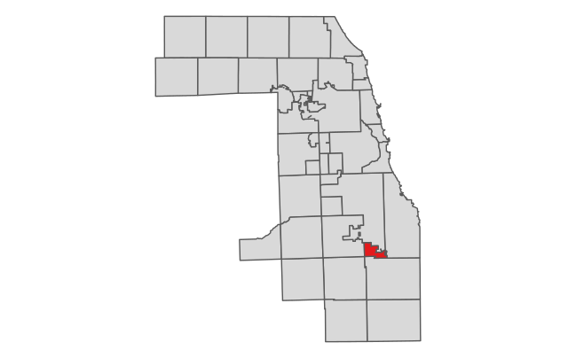

```{r, include = FALSE}
knitr::opts_chunk$set(
  collapse = TRUE,
  comment = "#>",
  message = FALSE
)
```

# Introduction

One of the unique features of PTAXSIM is the database that accompanies the package - this DB contains the only publicly accessible, machine-readable data collected from the various Cook County property tax agencies going back to 2006. While the primary use of PTAXSIM is its functionality to calculate tax bills, its database holds a plethora of data that can be used to investigate Cook County's property tax system, including the behavior of the over 900 taxing agencies and 400 TIFs that collect revenue through property taxes.

In this vignette, we'll demonstrate how to query data from the PTAXSIM SQLite database that can help us analyze taxing agencies' property tax revenue over time, as well as revenue collected by TIFs.

Additionally, we'll show how to account for the 2024 changes to the Cook County Clerk's agency fund report data structure which will be necessary for users to pay attention to when conducting a time series analysis of certain taxing agencies.

# Chicago's levy over time

Using data from the PTAXSIM database, let's look at the levy history for the City of Chicago from 2006 to 2024.

First, load some useful libraries and instantiate a PTAXSIM DBI connection with the default name (`ptaxsim_db_conn`) expected by PTAXSIM functions.

```{r}
library(data.table)
library(dplyr)
library(here)
library(ggplot2)
#library(ptaxsim)
devtools::load_all()

ptaxsim_db_conn <- DBI::dbConnect(RSQLite::SQLite(), here("./ptaxsim.db"))
```

```{r, echo=FALSE}
# This is needed to build the vignette using GitHub Actions
#ptaxsim_db_conn <- DBI::dbConnect(
 # RSQLite::SQLite(),
  #Sys.getenv("PTAXSIM_DB_PATH")
#)
```

First, we'll query the database table `agency_info` to determine the City of Chicago's unique `agency_num`.

```{r}
chi_agency_nums <- DBI::dbGetQuery(
  ptaxsim_db_conn,
  "
  SELECT agency_num, agency_name
  FROM agency_info
  WHERE agency_name LIKE '%CITY OF CHICAGO%'
  "
)

chi_agency_nums
```

Many taxing agencies pop up, most of which are Special Service Areas, or SSAs. SSAs typically overlay a commercial corridor where property owners will pay an additional tax to fund the SSA's additional serivces which can include maintenance, beautification and other additional services.

For purpose of our analysis, we'll just focus on `CITY OF CHICAGO` and `CITY OF CHICAGO LIBRARY FUND`, with agency fund numbers `030210000` and `030210002` respectively.

First, we'll query all fields from the `agencies` table.

```{r}
chi_agencies <- DBI::dbGetQuery(
  ptaxsim_db_conn,
  "
  SELECT DISTINCT *
  FROM agency
  WHERE agency_num = '030210000'
  OR agency_num = '030210001'
  "
)
```

When examining `chi_agencies`, we see that in 2024 the `CITY OF CHICAGO LIBRARY FUND` has a \$0 levy and therefore a tax rate of 0. This is because, starting in 2024, the Cook County Clerk began reporting the requested levy for the City of Chicago libraries as a fund under the `CITY OF CHICAGO` taxing agency. This is in fact aligned with how the City of Chicago reports its property tax levy in its own budget [documentation](https://chicityclerk.s3.us-west-2.amazonaws.com/s3fs-public/O2023-0005291_Tax_Levy.pdf).

This reporting change occurred for many municipal taxing agencies, where the Clerk had previously reported municipal fund levies as separate taxing agencies. This updated data structure begins in 2024 while years prior to 2024 remain the same, meaning users will need to account for this discrepancy if ever analyzing these taxing agencies data over time.

To make this process easier, we have added new fields to the `agency_info` table in the PTAXSIM database which identify the agencies that have been folded into their parent agencies. `agency_num_24` and `agency_name_24` contain the agency info that the old "sub-agency" has been merged into. Note that the user can still see details about these former agencies, now funds, by querying the `agency_fund` table.

```{r}
# Query agency_info table for all agencies with the 2024 update
agency_cw_24 <- DBI::dbGetQuery(
  ptaxsim_db_conn,
  "
  SELECT *
  FROM agency_info
  WHERE agency_change_24 = 1
  "
) %>%
  select(agency_num, agency_name, agency_num_24, agency_name_24)

agency_cw_24
```
We can now use `agency_cw_24` as a crosswalk to convert these sub-agencies to their parent agency numbers. 

Knowing this caveat about 2024 agency data, we'll query the both `CITY OF CHICAGO` and `CITY OF CHICAGO LIBRARY FUND` for all years, and then convert them to have the same `agency_num` using `agency_cw_24` so we can the levy data into one summed amount per year. This will ensure consistent reporting across the time series.

```{r}
chi_agencies <- chi_agencies %>%
  # Join the agency crosswalk to get the parent agency number for pre-2024 years
  left_join(agency_cw_24, "agency_num") %>%
  # for the agencies that did have an agency number change in 2024, replace the
  # old agency_num with the new one
  mutate(
    agency_num =
      ifelse(!is.na(agency_num_24),
             agency_num_24,
             agency_num)
  )
```

Now that we have the correct agency numbers for all years, we can select and aggregate the fields of interest for `CITY OF CHICAGO`. 

Many of the fields in the `agencies` table, which come from the Clerk's agency rate report, relate to PTELL calculations. Because the Chicago is a home rule municipality, it is not subject to PTELL limits as imposed by the State of Illinois, so these fields will not contain relevant info. However, the City of Chicago imposes [its own limits](https://codelibrary.amlegal.com/codes/chicago/latest/chicago_il/0-0-0-2608573) which mirror those of PTELL which we'll revisit later.

```{r}
chi_levy <- 
  chi_agencies %>%
  group_by(year, agency_num) %>%
  summarize(
    total_final_levy = sum(total_final_levy),
    total_final_rate = sum(total_final_rate),
    total_ext = sum(total_ext),
    cty_cook_eav = first(cty_cook_eav),
    prior_eav = first(prior_eav),
    curr_new_prop = first(curr_new_prop)
  )


chi_levy %>%
  pivot(cols = c(total_final_levy, total_final_rate, total_ext))
  
```


```{r, echo=FALSE}
chi_levy_plot_1 <- chi_levy %>%
  ggplot() +
  geom_line(aes(x = year, y = total_final_levy), linewidth = .8) +
  scale_x_continuous(n.breaks = 10) +
  scale_y_continuous(labels = scales::label_currency(), limits = c(0, 2000000000))  +
  theme_minimal() +
  theme(
    axis.title = element_text(size = 13),
    axis.title.x = element_text(margin = margin(t = 6)),
    axis.title.y = element_text(margin = margin(r = 6)),
    axis.text = element_text(size = 11),
    strip.text = element_text(size = 16),
    strip.background = element_rect(fill = "#c9c9c9"),
    legend.title = element_text(size = 14),
    legend.key.size = unit(24, "points"),
    legend.text = element_text(size = 12),
    legend.position = "bottom"
  )

plotly::plot_ly(chi_levy, x = ~year, 
                y = ~total_final_levy, 
                type = 'scatter')


```

</details>

<br>

```{r, echo=FALSE, out.width="100%"}
chi_levy_plot_1
```

This PIN's total tax bill has increased slightly since 2006, with some dips in the last few years. Let's see how much it would've increased *without* its Homeowner Exemption.

## Removing exemptions

We can remove exemptions by modifying the inputs to the `tax_bill()` function and then recalculating each bill.

First, we retrieve the `pin_dt` input to `tax_bill()` by using the `lookup_pin()` function. This input contains all of the exemptions, AV, and EAV information for each PIN. By default, it has the actual historical values, but we can modify it to produce counterfactual bills. In this case, we can remove all exemptions by setting the amount in each exemption column (prefixed with `exe_`) to zero.

```{r}
exe_dt <- lookup_pin(2006:2020, "25321140050000") %>%
  mutate(across(starts_with("exe_"), ~0)) %>%
  setDT(key = c("year", "pin"))
```

Then, we recalculate each bill using the new, zeroed-out `pin_dt`.

```{r}
bills_no_exe <- tax_bill(2006:2020,
  "25321140050000",
  pin_dt = exe_dt,
  simplify = FALSE
)
```

Next, we do the same aggregation that we did for bills *with* exemptions, collapsing each bill into a total by year.

```{r}
bills_no_exe_summ <- bills_no_exe %>%
  group_by(year) %>%
  summarize(
    exe = sum(tax_amt_exe),
    bill_total = sum(final_tax_to_tif) + sum(final_tax_to_dist),
    Type = "No exemptions"
  ) %>%
  select(Year = year, Type, "Exemption Amt." = exe, "Bill Amt." = bill_total)
```

Finally, we can compare the real bills (with exemptions) to the counterfactual bills we just created (without exemptions).

<details>

<summary><strong>Click here</strong> to show plot code</summary>

```{r, echo=FALSE}
bills_plot_2 <- rbind(bills_w_exe_summ, bills_no_exe_summ) %>%
  ggplot() +
  geom_line(aes(x = Year, y = `Bill Amt.`, linetype = Type), linewidth = 1.1) +
  scale_x_continuous(n.breaks = 9) +
  scale_y_continuous(labels = scales::label_dollar(), limits = c(0, 6500)) +
  scale_linetype_manual(
    name = "",
    values = c("With exemptions" = "solid", "No exemptions" = "dashed")
  ) +
  theme_minimal() +
  theme(
    axis.title = element_text(size = 13),
    axis.title.x = element_text(margin = margin(t = 6)),
    axis.title.y = element_text(margin = margin(r = 6)),
    axis.text = element_text(size = 11),
    strip.text = element_text(size = 16),
    strip.background = element_rect(fill = "#c9c9c9"),
    legend.title = element_text(size = 14),
    legend.key.size = unit(24, "points"),
    legend.text = element_text(size = 12),
    legend.position = "bottom"
  )
```

</details>

<br>

```{r, echo=FALSE, out.width="100%"}
bills_plot_2
```

The exemption amount for this PIN has increased in tandem with increases in the local tax rate. There were also a statutory increases in the amount of the Homeowner Exemption during the same time period.

## Changing exemptions

We can also use PTAXSIM to answer hypotheticals. For example, how would this PIN's bill history change if the Homeowner Exemption increased from \$10,000 to \$15,000 in 2018?

To find out, we again create a modified PIN input to pass to `tax_bill()`. This time, we increase the Homeowner Exemption to \$15,000 for all years after 2018.

```{r}
exe_dt_2 <- lookup_pin(2006:2020, "25321140050000") %>%
  mutate(exe_homeowner = ifelse(year >= 2018, 15000, exe_homeowner)) %>%
  setDT(key = c("year", "pin"))
```

Then, we recalculate all the bills with the new PIN input and do the same aggregation as before.

```{r}
bills_new_exe <- tax_bill(
  2006:2020,
  "25321140050000",
  pin_dt = exe_dt_2,
  simplify = FALSE
)

bills_new_exe_summ <- bills_new_exe %>%
  group_by(year) %>%
  summarize(
    exe = sum(tax_amt_exe),
    bill_total = sum(final_tax_to_tif) + sum(final_tax_to_dist),
    Type = "Changed exemption"
  ) %>%
  select(Year = year, Type, "Exemption Amt." = exe, "Bill Amt." = bill_total)
```

Finally, we add a third line to our plot showing the total tax bill by year after the hypothetical exemption increase in 2018.

<details>

<summary><strong>Click here</strong> to show plot code</summary>

```{r}
bills_plot_3 <- rbind(
  bills_w_exe_summ,
  bills_no_exe_summ,
  bills_new_exe_summ
) %>%
  ggplot() +
  geom_line(aes(x = Year, y = `Bill Amt.`, linetype = Type), linewidth = 1.1) +
  scale_x_continuous(n.breaks = 9) +
  scale_y_continuous(labels = scales::label_dollar(), limits = c(0, 6500)) +
  scale_linetype_manual(
    name = "",
    values = c(
      "With exemptions" = "solid",
      "No exemptions" = "dashed",
      "Changed exemption" = "dotted"
    )
  ) +
  theme_minimal() +
  theme(
    axis.title = element_text(size = 13),
    axis.title.x = element_text(margin = margin(t = 6)),
    axis.title.y = element_text(margin = margin(r = 6)),
    axis.text = element_text(size = 11),
    strip.text = element_text(size = 16),
    strip.background = element_rect(fill = "#c9c9c9"),
    legend.title = element_text(size = 14),
    legend.key.size = unit(24, "points"),
    legend.text = element_text(size = 12),
    legend.position = "bottom"
  )
```

</details>

<br>

```{r, echo=FALSE, out.width="100%"}
bills_plot_3
```

Increasing the Homeowner Exemption to \$15,000 would save this property owner around \$1,000 per year in taxes. However, this hypothetical does not account for changes in the tax base that would occur if overall exemption amounts changed, so it is (slightly) inaccurate.

# Many PINs

PTAXSIM can also perform more complex analysis, such as measuring the impact of exemptions in a given area. To perform this analysis, we can again use the `tax_bill()` function to calculate tax bills before and after exemptions are removed, this time for many PINs.

## Removing exemptions

Let's look at the overall effect of exemptions in the Cook County township of Calumet, shown in [<strong>red</strong>]{style="color:#e41a1c"} below.



First, we can use the PTAXSIM database to get a list of all the unique PINs in Calumet township. We can also create a vector of years we're interested in.

```{r}
t_pins <- DBI::dbGetQuery(
  ptaxsim_db_conn,
  "
  SELECT DISTINCT pin
  FROM pin
  WHERE substr(tax_code_num, 1, 2) = '14'
  "
)
t_pins <- t_pins$pin
t_years <- 2006:2020
```

Next, we can generate bills for all PINs in Calumet for the past 15 years. These bills will *include* any exemptions they actually received.

We're using `data.table` syntax here because it's much faster than `dplyr` when working with large data. Note that PTAXSIM functions always output a `data.table` with keys.

```{r}
t_bills_w_exe <- tax_bill(t_years, t_pins)[, stage := "With exemptions"]
```

Unlike a single PIN, removing exemptions from many PINs means that the base (the amount of total taxable value available) will change substantially. In order to accurately model the effect of removing exemptions, we need to fully recalculate the base of each district by adding the sum of taxable value recovered from each PIN.

To start, we use the `lookup_pin()` function to recover the total EAV of exemptions for each PIN.

```{r}
t_pin_dt_no_exe <- lookup_pin(t_years, t_pins)
t_pin_dt_no_exe[, tax_code := lookup_tax_code(year, pin)]

exe_cols <- names(t_pin_dt_no_exe)[startsWith(names(t_pin_dt_no_exe), "exe_")]
t_tc_sum_no_exe <- t_pin_dt_no_exe[,
  .(exe_total = sum(rowSums(.SD))),
  .SDcols = exe_cols,
  by = .(year, tax_code)
]
```

Next, we recalculate the base of all taxing districts in Calumet by adding the EAV returned from exemptions to each district's total EAV.

```{r}
t_agency_dt_no_exe <- lookup_agency(t_years, t_pin_dt_no_exe$tax_code)
t_agency_dt_no_exe[
  t_tc_sum_no_exe,
  on = .(year, tax_code),
  agency_total_eav := agency_total_eav + exe_total
]
```

Then, we again alter the `pin_dt` input by setting all exemption columns equal to zero.

```{r}
t_pin_dt_no_exe[, (exe_cols) := 0][, c("tax_code") := NULL]
```

We recalculate all Calumet tax bills *without* exemptions and with an updated tax base for each district (passed via `agency_dt`).

```{r}
t_bills_no_exe <- tax_bill(
  year_vec = t_years,
  pin_vec = t_pins,
  agency_dt = t_agency_dt_no_exe,
  pin_dt = t_pin_dt_no_exe
)[
  , stage := "No exemptions"
]
```

To see the results, we can calculate the average tax bill by year by property type (residential or commercial), with and without exemptions. We can also index the result to the earliest year available (in this case 2006) to make the different property types comparable on the same scale.

```{r}
# Little function to get the statistical mode
Mode <- function(x) {
  ux <- unique(x)
  ux[which.max(tabulate(match(x, ux)))]
}

t_no_exe_summ <- rbind(t_bills_w_exe, t_bills_no_exe)[
  , class := Mode(substr(class, 1, 1)),
  by = pin
][
  class %in% c("2", "3", "5"),
][
  , class := ifelse(class == "2", "Residential", "Commercial")
][
  , .(total_bill = sum(final_tax)),
  by = .(year, pin, class, stage)
][
  , .(avg_bill = mean(total_bill)),
  by = .(year, class, stage)
][
  , idx_bill := (avg_bill / avg_bill[year == 2006]) * 100,
  by = .(class, stage)
]
```

Finally, we can plot the average bill with and without exemptions by property type.

<details>

<summary><strong>Click here</strong> to show plot code</summary>

```{r}
t_annot <- tibble(
  class = c("Residential", "Commercial"),
  x = c(2008, 2006.4),
  y = c(105, 115)
)

# Plot the change in indexed values over time
t_no_exe_summ_plot <- ggplot(data = t_no_exe_summ) +
  geom_line(
    aes(x = year, y = idx_bill, color = class, linetype = stage),
    linewidth = 1.1
  ) +
  geom_text(
    data = t_annot,
    aes(x = x, y = y, color = class, label = class),
    hjust = 0
  ) +
  scale_y_continuous(name = "Average Tax Bill, Indexed to 2006") +
  scale_x_continuous(name = "Year", n.breaks = 10, limits = c(2006, 2020.4)) +
  scale_linetype_manual(
    name = "",
    values = c("With exemptions" = "solid", "No exemptions" = "dashed")
  ) +
  scale_color_brewer(name = "", palette = "Set1", direction = -1) +
  guides(color = "none") +
  facet_wrap(vars(class)) +
  theme_minimal() +
  theme(
    axis.title = element_text(size = 13),
    axis.title.x = element_text(margin = margin(t = 6)),
    axis.title.y = element_text(margin = margin(r = 6)),
    axis.text.y = element_text(size = 11),
    strip.text = element_text(size = 16),
    strip.background = element_rect(fill = "#c9c9c9"),
    legend.title = element_text(size = 14),
    legend.key.size = unit(24, "points"),
    legend.text = element_text(size = 12),
    legend.position = "bottom"
  )
```

</details>

<br>

```{r, echo=FALSE, out.width="100%"}
t_no_exe_summ_plot
```

Exemptions in Calumet have significantly increased in both volume and amount (via increased tax rates) in recent years. In 2019, the average residential homeowner saved around \$1,100 via exemptions.

Conversely, Calumet's commercial property owners have picked up an increasingly large share of the overall tax burden since 2006. In 2019, the average commercial property paid about \$1,100 more than they would have if exemptions did not exist.

## Changing exemptions

PTAXSIM can also answer hypotheticals about large areas. For example, how would the average residential tax bill in Calumet change if the Senior Exemption increased by \$5,000 and the Senior Freeze Exemption was removed?

To find out, we again create a PIN input with modified exemption amounts, then recalculate the base by taking the difference between the real and hypothetical exemptions.

```{r}
t_pin_dt_new_exe <- lookup_pin(t_years, t_pins)
t_pin_dt_new_exe[, tax_code := lookup_tax_code(year, pin)]

t_tc_sum_new_exe <- t_pin_dt_new_exe[
  , .(exe_total = sum(exe_freeze - (5000 * (exe_senior != 0)))),
  by = .(year, tax_code)
]
```

Next, we recalculate the base of each district. This time, the base may *lose* some EAV, since the Senior Exemption is increasing substantially.

```{r}
t_agency_dt_new_exe <- lookup_agency(t_years, t_pin_dt_new_exe$tax_code)
t_agency_dt_new_exe[
  t_tc_sum_new_exe,
  on = .(year, tax_code),
  agency_total_eav := agency_total_eav + exe_total
]
```

Then, we again alter the `pin_dt` input by setting the Senior Freeze Exemption to zero and adding \$5,000 to any Senior Exemption.

```{r}
t_pin_dt_new_exe <- t_pin_dt_new_exe[
  , exe_freeze := 0
][
  exe_senior != 0, exe_senior := exe_senior + 5000
][
  , c("tax_code") := NULL
]
```

We again recalculate all Calumet tax bills with our updated exemptions and with an updated tax base for each district.

```{r}
t_bills_new_exe <- tax_bill(
  year_vec = t_years,
  pin_vec = t_pins,
  agency_dt = t_agency_dt_new_exe,
  pin_dt = t_pin_dt_new_exe
)[
  , stage := "Changed exemptions"
]
```

Then, do the same aggregation and indexing we did previously, this time using the updated bills.

```{r}
t_new_exe_summ <- rbind(t_bills_w_exe, t_bills_new_exe)[
  , class := Mode(substr(class, 1, 1)),
  by = pin
][
  class %in% c("2", "3", "5"),
][
  , class := ifelse(class == "2", "Residential", "Commercial")
][
  , .(total_bill = sum(final_tax)),
  by = .(year, pin, class, stage)
][
  , .(avg_bill = mean(total_bill)),
  by = .(year, class, stage)
][
  , idx_bill := (avg_bill / avg_bill[year == 2006]) * 100,
  by = .(class, stage)
]
```

Finally, we can plot the original bills against the updated ones.

<details>

<summary><strong>Click here</strong> to show plot code</summary>

```{r}
t_new_exe_summ_plot <- ggplot(data = t_new_exe_summ) +
  geom_line(
    aes(x = year, y = idx_bill, color = class, linetype = stage),
    linewidth = 1.1
  ) +
  geom_text(
    data = t_annot,
    aes(x = x, y = y, color = class, label = class),
    hjust = 0
  ) +
  scale_y_continuous(name = "Average Tax Bill, Indexed to 2006") +
  scale_x_continuous(name = "Year", n.breaks = 10, limits = c(2006, 2020.4)) +
  scale_linetype_manual(
    name = "",
    values = c("With exemptions" = "solid", "Changed exemptions" = "dotted")
  ) +
  scale_color_brewer(name = "", palette = "Set1", direction = -1) +
  guides(color = "none") +
  facet_wrap(vars(class)) +
  theme_minimal() +
  theme(
    axis.title = element_text(size = 13),
    axis.title.x = element_text(margin = margin(t = 6)),
    axis.title.y = element_text(margin = margin(r = 6)),
    axis.text.y = element_text(size = 11),
    strip.text = element_text(size = 16),
    strip.background = element_rect(fill = "#c9c9c9"),
    legend.title = element_text(size = 14),
    legend.key.size = unit(24, "points"),
    legend.text = element_text(size = 12),
    legend.position = "bottom"
  )
```

</details>

<br>

```{r, out.width="100%", echo=FALSE}
t_new_exe_summ_plot
```

The net effect of increasing the Senior Exemption while removing the Senior Freeze Exemption is a slight decrease in the *average* bill. However, this conclusion is ambiguous, complicated by the fact that the Senior Freeze is means-tested, while the Senior Exemption is not. The "real-world effect" of our hypothetical policy change would most likely be an increase in the property tax bills of poorer seniors, even though the average bill decreased.

Ultimately, with some careful coding and assumptions, PTAXSIM (and its included data) can be used to test almost any hypothetical change in exemptions.
