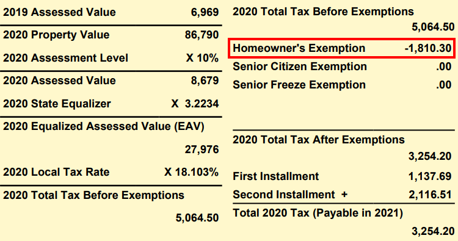
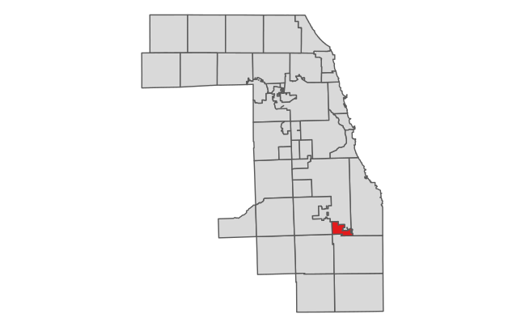

```{r, include = FALSE}
knitr::opts_chunk$set(
  collapse = TRUE,
  comment = "#>",
  message = FALSE
)
```

# Introduction

Property tax exemptions are savings that lower a homeowner’s property tax bill. They work by multiplying the composite tax rate for the area by a flat amount. For example, in the bill below (PIN = **25-32-114-005-0000**), the local tax rate of 18.898% is multiplied by the Homeowner Exemption flat amount of \$10,000, yielding an exemption amount of \$1,889.80.



This amount is then deducted from the Equalized Assessed Value (EAV) of the property to get the final taxable value. Exemption amounts can vary significantly from area to area, since they are dependent on each area's local composite tax rate.

PTAXSIM can determine the impact of exemptions both for single properties and large areas, such as municipalities. We demonstrate both in this vignette.

# Single PIN

Using PTAXSIM, let's look at the historic impact of exemptions for a single PIN by recalculating its tax bills without any exemptions.

First, load some useful libraries and instantiate a PTAXSIM DBI connection with the default name (`ptaxsim_db_conn`) expected by PTAXSIM functions.

```{r}
library(data.table)
library(dplyr)
library(here)
library(ggplot2)
library(ptaxsim)

ptaxsim_db_conn <- DBI::dbConnect(RSQLite::SQLite(), here("./ptaxsim.db"))
```

The PIN we'll use is **25-32-114-005-0000**, the same PIN whose bill is shown above. This is a small, single-family property in Calumet with a very typical exemption situation, just a Homeowner Exemption.

We can use the `tax_bill()` function to get every bill for this PIN from the last 15 years. These bills will _include_ any reduction from exemptions the PIN received.

```{r}
bills_w_exe <- tax_bill(2006:2020, "25321140050000", simplify = FALSE)
```

Next, we can use `dplyr` to collapse the line-item bills into totals by year.

```{r}
bills_w_exe_summ <- bills_w_exe %>%
  group_by(year) %>%
  summarize(
    exe = sum(tax_amt_exe),
    bill_total = sum(final_tax_to_tif) + sum(final_tax_to_dist),
    Type = "With exemptions"
  ) %>%
  select(Year = year, Type, "Exemption Amt." = exe, "Bill Amt." = bill_total)
```

Finally, we can plot the change in total bill amount over time.

<details>

<summary><strong>Click here</strong> to show plot code</summary>

```{r, echo=FALSE}
bills_plot_1 <- bills_w_exe_summ %>%
  ggplot() +
  geom_line(aes(x = Year, y = `Bill Amt.`, linetype = Type), size = 1.1) +
  scale_x_continuous(n.breaks = 9) +
  scale_y_continuous(labels = scales::label_dollar(), limits = c(0, 6500)) +
  scale_linetype_manual(
    name = "",
    values = c("With exemptions" = "solid")
  ) +
  theme_minimal() +
  theme(
    axis.title = element_text(size = 13),
    axis.title.x = element_text(margin = margin(t = 6)),
    axis.title.y = element_text(margin = margin(r = 6)),
    axis.text = element_text(size = 11),
    strip.text = element_text(size = 16),
    strip.background = element_rect(fill = "#c9c9c9"),
    legend.title = element_text(size = 14),
    legend.key.size = unit(24, "points"),
    legend.text = element_text(size = 12),
    legend.position = "bottom"
  )
```

</details>

<br>

```{r, echo=FALSE, out.width="100%"}
bills_plot_1
```

This PIN's total tax bill has increased slightly since 2006, with some dips in the last few years. Let's see how much it would've increased _without_ its Homeowner Exemption.

## Removing exemptions

We can remove exemptions by modifying the inputs to the `tax_bill()` function and then recalculating each bill.

First, we retrieve the `pin_dt` input to `tax_bill()` by using the `lookup_pin()` function. This input contains all of the exemptions, AV, and EAV information for each PIN. By default, it has the actual historical values, but we can modify it to produce counterfactual bills. In this case, we can remove all exemptions by setting the amount in each exemption column (prefixed with `exe_`) to zero.

```{r}
exe_dt <- lookup_pin(2006:2020, "25321140050000") %>%
  mutate(across(starts_with("exe_"), ~ 0)) %>%
  setDT(key = c("year", "pin"))
```

Then, we recalculate each bill using the new, zeroed-out `pin_dt`.

```{r}
bills_no_exe <- tax_bill(2006:2020,
  "25321140050000",
  pin_dt = exe_dt,
  simplify = FALSE
)
```

Next, we do the same aggregation that we did for bills _with_ exemptions, collapsing each bill into a total by year.

```{r}
bills_no_exe_summ <- bills_no_exe %>%
  group_by(year) %>%
  summarize(
    exe = sum(tax_amt_exe),
    bill_total = sum(final_tax_to_tif) + sum(final_tax_to_dist),
    Type = "No exemptions"
  ) %>%
  select(Year = year, Type, "Exemption Amt." = exe, "Bill Amt." = bill_total)
```

Finally, we can compare the real bills (with exemptions) to the counterfactual bills we just created (without exemptions).

<details>

<summary><strong>Click here</strong> to show plot code</summary>

```{r, echo=FALSE}
bills_plot_2 <- rbind(bills_w_exe_summ, bills_no_exe_summ) %>%
  ggplot() +
  geom_line(aes(x = Year, y = `Bill Amt.`, linetype = Type), size = 1.1) +
  scale_x_continuous(n.breaks = 9) +
  scale_y_continuous(labels = scales::label_dollar(), limits = c(0, 6500)) +
  scale_linetype_manual(
    name = "",
    values = c("With exemptions" = "solid", "No exemptions" = "dashed")
  ) +
  theme_minimal() +
  theme(
    axis.title = element_text(size = 13),
    axis.title.x = element_text(margin = margin(t = 6)),
    axis.title.y = element_text(margin = margin(r = 6)),
    axis.text = element_text(size = 11),
    strip.text = element_text(size = 16),
    strip.background = element_rect(fill = "#c9c9c9"),
    legend.title = element_text(size = 14),
    legend.key.size = unit(24, "points"),
    legend.text = element_text(size = 12),
    legend.position = "bottom"
  )
```

</details>

<br>

```{r, echo=FALSE, out.width="100%"}
bills_plot_2
```

The exemption amount for this PIN has increased in tandem with increases in the local tax rate. There were also a statutory increases in the amount of the Homeowner Exemption during the same time period.

## Changing exemptions

We can also use PTAXSIM to answer hypotheticals. For example, how would this PIN's bill history change if the Homeowner Exemption increased from \$10,000 to \$15,000 in 2018?

To find out, we again create a modified PIN input to pass to `tax_bill()`. This time, we increase the Homeowner Exemption to $15,000 for all years after 2018. 

```{r}
exe_dt_2 <- lookup_pin(2006:2020, "25321140050000") %>%
  mutate(exe_homeowner = ifelse(year >= 2018, 15000, exe_homeowner)) %>%
  setDT(key = c("year", "pin"))
```

Then, we recalculate all the bills with the new PIN input and do the same aggregation as before.

```{r}
bills_new_exe <- tax_bill(
  2006:2020,
  "25321140050000",
  pin_dt = exe_dt_2,
  simplify = FALSE
)

bills_new_exe_summ <- bills_new_exe %>%
  group_by(year) %>%
  summarize(
    exe = sum(tax_amt_exe),
    bill_total = sum(final_tax_to_tif) + sum(final_tax_to_dist),
    Type = "Changed exemption"
  ) %>%
  select(Year = year, Type, "Exemption Amt." = exe, "Bill Amt." = bill_total)
```

Finally, we add a third line to our plot showing the total tax bill by year after the hypothetical exemption increase in 2018.

<details>

<summary><strong>Click here</strong> to show plot code</summary>

```{r}
bills_plot_3 <- rbind(
  bills_w_exe_summ, 
  bills_no_exe_summ,
  bills_new_exe_summ
) %>%
  ggplot() +
  geom_line(aes(x = Year, y = `Bill Amt.`, linetype = Type), size = 1.1) +
  scale_x_continuous(n.breaks = 9) +
  scale_y_continuous(labels = scales::label_dollar(), limits = c(0, 6500)) +
  scale_linetype_manual(
    name = "",
    values = c(
      "With exemptions" = "solid",
      "No exemptions" = "dashed",
      "Changed exemption" = "dotted"
    )
  ) +
  theme_minimal() +
  theme(
    axis.title = element_text(size = 13),
    axis.title.x = element_text(margin = margin(t = 6)),
    axis.title.y = element_text(margin = margin(r = 6)),
    axis.text = element_text(size = 11),
    strip.text = element_text(size = 16),
    strip.background = element_rect(fill = "#c9c9c9"),
    legend.title = element_text(size = 14),
    legend.key.size = unit(24, "points"),
    legend.text = element_text(size = 12),
    legend.position = "bottom"
  )
```

</details>

<br>

```{r, echo=FALSE, out.width="100%"}
bills_plot_3
```

Increasing the Homeowner Exemption to \$15,000 would save this property owner around \$1,000 per year in taxes. However, this hypothetical does not account for changes in the tax base that would occur if overall exemption amounts changed, so it is (slightly) inaccurate.

# Many PINs

PTAXSIM can also perform more complex analysis, such as measuring the impact of exemptions in a given area. To perform this analysis, we can again use the `tax_bill()` function to calculate tax bills before and after exemptions are removed, this time for many PINs.

## Removing exemptions

Let's look at the overall effect of exemptions in the Cook County township of Calumet, shown in <span style="color:#e41a1c"><strong>red</strong></span> below.



First, we can use the PTAXSIM database to get a list of all the unique PINs in Calumet township. We can also create a vector of years we're interested in.

```{r}
t_pins <- DBI::dbGetQuery(
  ptaxsim_db_conn,
  "
  SELECT DISTINCT pin
  FROM pin
  WHERE substr(tax_code_num, 1, 2) = '14'
  "
)
t_pins <- t_pins$pin
t_years <- 2006:2020
```

Next, we can generate bills for all PINs in Calumet for the past 15 years. These bills will _include_ any exemptions they actually received.

We're using `data.table` syntax here because it's much faster than `dplyr` when working with large data. Note that PTAXSIM functions always output a `data.table` with keys.

```{r}
t_bills_w_exe <- tax_bill(t_years, t_pins)[, stage := "With exemptions"]
```

Unlike a single PIN, removing exemptions from many PINs means that the base (the amount of total taxable value available) will change substantially. In order to accurately model the effect of removing exemptions, we need to fully recalculate the base of each district by adding the sum of taxable value recovered from each PIN. 

To start, we use the `lookup_pin()` function to recover the total EAV of exemptions for each PIN.

```{r}
t_pin_dt_no_exe <- lookup_pin(t_years, t_pins)
t_pin_dt_no_exe[, tax_code := lookup_tax_code(year, pin)]

exe_cols <- names(t_pin_dt_no_exe)[startsWith(names(t_pin_dt_no_exe), "exe_")]
t_tc_sum_no_exe <- t_pin_dt_no_exe[,
  .(exe_total = sum(rowSums(.SD))),
  .SDcols = exe_cols,
  by = .(year, tax_code)
]
```

Next, we recalculate the base of all taxing districts in Calumet by adding the EAV returned from exemptions to each district's total EAV.

```{r}
t_agency_dt_no_exe <- lookup_agency(t_years, t_pin_dt_no_exe$tax_code)
t_agency_dt_no_exe[
  t_tc_sum_no_exe,
  on = .(year, tax_code),
  agency_total_eav := agency_total_eav + exe_total
]
```

Then, we again alter the `pin_dt` input by setting all exemption columns equal to zero.

```{r}
t_pin_dt_no_exe[, (exe_cols) := 0][, c("tax_code") := NULL]
```

We recalculate all Calumet tax bills _without_ exemptions and with an updated tax base for each district (passed via `agency_dt`).

```{r}
t_bills_no_exe <- tax_bill(
  year_vec = t_years,
  pin_vec = t_pins,
  agency_dt = t_agency_dt_no_exe,
  pin_dt = t_pin_dt_no_exe
)[
  , stage := "No exemptions"
]
```

To see the results, we can calculate the average tax bill by year by property type (residential or commercial), with and without exemptions. We can also index the result to the earliest year available (in this case 2006) to make the different property types comparable on the same scale.

```{r}
# Little function to get the statistical mode
Mode <- function(x) {
  ux <- unique(x)
  ux[which.max(tabulate(match(x, ux)))]
}

t_no_exe_summ <- rbind(t_bills_w_exe, t_bills_no_exe)[
  , class := Mode(substr(class, 1, 1)), by = pin
][
  class %in% c("2", "3", "5"),
][
  , class := ifelse(class == "2", "Residential", "Commercial")
][
  , .(total_bill = sum(final_tax)), by = .(year, pin, class, stage)
][
  , .(avg_bill = mean(total_bill)), by = .(year, class, stage)
][
  , idx_bill := (avg_bill / avg_bill[year == 2006]) * 100, by = .(class, stage)
]
```

Finally, we can plot the average bill with and without exemptions by property type. 

<details>

<summary><strong>Click here</strong> to show plot code</summary>

```{r}
t_annot <- tibble(
  class = c("Residential", "Commercial"),
  x = c(2008, 2006.4),
  y = c(105, 115)
)

# Plot the change in indexed values over time 
t_no_exe_summ_plot <- ggplot(data = t_no_exe_summ) +
  geom_line(
    aes(x = year, y = idx_bill, color = class, linetype = stage),
    size = 1.1
  ) +
  geom_text(
    data = t_annot,
    aes(x = x, y = y, color = class, label = class),
    hjust = 0
  ) + 
  scale_y_continuous(name = "Average Tax Bill, Indexed to 2006") +
  scale_x_continuous(name = "Year", n.breaks = 10, limits = c(2006, 2020.4)) +
  scale_linetype_manual(
    name = "",
    values = c("With exemptions" = "solid", "No exemptions" = "dashed")
  ) +
  scale_color_brewer(name = "", palette = "Set1", direction = -1) +
  guides(color = "none") +
  facet_wrap(vars(class)) +
  theme_minimal() +
  theme(
    axis.title = element_text(size = 13),
    axis.title.x = element_text(margin = margin(t = 6)),
    axis.title.y = element_text(margin = margin(r = 6)),
    axis.text.y = element_text(size = 11),
    strip.text = element_text(size = 16),
    strip.background = element_rect(fill = "#c9c9c9"),
    legend.title = element_text(size = 14),
    legend.key.size = unit(24, "points"),
    legend.text = element_text(size = 12),
    legend.position = "bottom"
  )
```

</details>

<br>

```{r, echo=FALSE, out.width="100%"}
t_no_exe_summ_plot
```

Exemptions in Calumet have significantly increased in both volume and amount (via increased tax rates) in recent years. In 2019, the average residential homeowner saved around $1,100 via exemptions.

Conversely, Calumet's commercial property owners have picked up an increasingly large share of the overall tax burden since 2006. In 2019, the average commercial property paid about $1,100 more than they would have if exemptions did not exist.

## Changing exemptions 

PTAXSIM can also answer hypotheticals about large areas. For example, how would the average residential tax bill in Calumet change if the Senior Exemption increased by $5,000 and the Senior Freeze Exemption was removed?

To find out, we again create a PIN input with modified exemption amounts, then recalculate the base by taking the difference between the real and hypothetical exemptions.

```{r}
t_pin_dt_new_exe <- lookup_pin(t_years, t_pins)
t_pin_dt_new_exe[, tax_code := lookup_tax_code(year, pin)]

t_tc_sum_new_exe <- t_pin_dt_new_exe[
  , .(exe_total = sum(exe_freeze - (5000 * (exe_senior != 0)))),
  by = .(year, tax_code)
]
```

Next, we recalculate the base of each district. This time, the base may _lose_ some EAV, since the Senior Exemption is increasing substantially.

```{r}
t_agency_dt_new_exe <- lookup_agency(t_years, t_pin_dt_new_exe$tax_code)
t_agency_dt_new_exe[
  t_tc_sum_new_exe,
  on = .(year, tax_code),
  agency_total_eav := agency_total_eav + exe_total
]
```

Then, we again alter the `pin_dt` input by setting the Senior Freeze Exemption to zero and adding $5,000 to any Senior Exemption.

```{r}
t_pin_dt_new_exe <- t_pin_dt_new_exe[
  , exe_freeze := 0
][
  exe_senior != 0, exe_senior := exe_senior + 5000
][
  , c("tax_code") := NULL
]
```

We again recalculate all Calumet tax bills with our updated exemptions and with an updated tax base for each district.

```{r}
t_bills_new_exe <- tax_bill(
  year_vec = t_years,
  pin_vec = t_pins,
  agency_dt = t_agency_dt_new_exe,
  pin_dt = t_pin_dt_new_exe
)[
  , stage := "Changed exemptions"
]
```

Then, do the same aggregation and indexing we did previously, this time using the updated bills.

```{r}
t_new_exe_summ <- rbind(t_bills_w_exe, t_bills_new_exe)[
  , class := Mode(substr(class, 1, 1)), by = pin
][
  class %in% c("2", "3", "5"),
][
  , class := ifelse(class == "2", "Residential", "Commercial")
][
  , .(total_bill = sum(final_tax)), by = .(year, pin, class, stage)
][
  , .(avg_bill = mean(total_bill)), by = .(year, class, stage)
][
  , idx_bill := (avg_bill / avg_bill[year == 2006]) * 100, by = .(class, stage)
]
```

Finally, we can plot the original bills against the updated ones.

<details>

<summary><strong>Click here</strong> to show plot code</summary>

```{r}
t_new_exe_summ_plot <- ggplot(data = t_new_exe_summ) +
  geom_line(
    aes(x = year, y = idx_bill, color = class, linetype = stage),
    size = 1.1
  ) +
  geom_text(
    data = t_annot,
    aes(x = x, y = y, color = class, label = class),
    hjust = 0
  ) + 
  scale_y_continuous(name = "Average Tax Bill, Indexed to 2006") +
  scale_x_continuous(name = "Year", n.breaks = 10, limits = c(2006, 2020.4)) +
  scale_linetype_manual(
    name = "",
    values = c("With exemptions" = "solid", "Changed exemptions" = "dotted")
  ) +
  scale_color_brewer(name = "", palette = "Set1", direction = -1) +
  guides(color = "none") +
  facet_wrap(vars(class)) +
  theme_minimal() +
  theme(
    axis.title = element_text(size = 13),
    axis.title.x = element_text(margin = margin(t = 6)),
    axis.title.y = element_text(margin = margin(r = 6)),
    axis.text.y = element_text(size = 11),
    strip.text = element_text(size = 16),
    strip.background = element_rect(fill = "#c9c9c9"),
    legend.title = element_text(size = 14),
    legend.key.size = unit(24, "points"),
    legend.text = element_text(size = 12),
    legend.position = "bottom"
  )
```

</details>

<br>

```{r, out.width="100%", echo=FALSE}
t_new_exe_summ_plot
```

The net effect of increasing the Senior Exemption while removing the Senior Freeze Exemption is a slight decrease in the _average_ bill. However, this is complicated by the fact that the Senior Freeze is means-tested, while the Senior Exemption is not. The reality of our hypothetical change is mostly likely an increase in the property tax bills of poorer seniors, even though the average bill decreased.

Ultimately, with some careful coding and assumptions, PTAXSIM (and its included data) can be used to test almost any hypothetical change in exemptions.