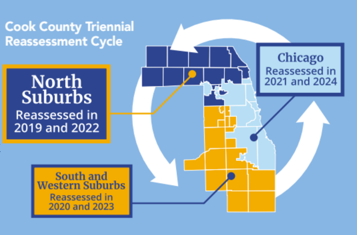

```{r setup, include=FALSE}
knitr::opts_chunk$set(
  collapse = TRUE,
  comment = "#>",
  message = FALSE
)
```

# Introduction

Reassessment is the process of valuing a group of properties, as of a given date, for the purpose of property taxation. In Cook County, reassessment occurs on a triennial cycle, meaning each property is reassessed every three years. Cook County is split into three parts, called triads: the north suburbs, the south suburbs, and the City of Chicago. Each part is reassessed following the cycle below:



Reassessment, along with changes in the amount of tax revenue required by local taxing agencies, drives changes in tax bills each year. Reassessment typically has only a small impact on the *median* bill (unless reassessment significantly shifts the geographic distribution of the tax base). Showing exactly how bills are affected by reassessment is extremely difficult due to the complexity of Cook County's property tax system.

Enter PTAXSIM. PTAXSIM can deconstruct historical tax bills, both from individual properties and large geographies, to help explain how and why bills have changed. PTAXSIM also contains the data and tools necessary to estimate the impact of future reassessments. Both abilities are demonstrated in this vignette.

# Historical reassessments

We'll start with historical analysis. PTAXSIM contains the data necessary to calculate all tax bills after 2006. We can use this data to examine how reassessments have changed property tax bills, starting with a single PIN and moving to an entire township.

## Single PIN

To begin, load some useful libraries and instantiate a PTAXSIM database connection with the default name (`ptaxsim_db_conn`) expected by PTAXSIM functions.

```{r}
library(DBI)
library(data.table)
library(dplyr)
library(ggplot2)
library(ggspatial)
library(gstat)
library(here)
library(httr)
library(jsonlite)
library(ptaxsim)
library(sf)
library(stars)
library(stringr)
library(tidyr)

ptaxsim_db_conn <- DBI::dbConnect(RSQLite::SQLite(), here("./ptaxsim.db"))
```

The example PIN we’ll use is **16-26-406-015-0000**. This is a small, single-family property in West Chicago without any exemptions. We can use the `tax_bill()` function to get every bill for this PIN from 2006 to 2021. 

```{r}
p <- tax_bill(2006:2021, "16264060150000")
```

Next, we can use `dplyr` to collapse the line-item bills into totals by year, then plot the change in assessed value and total tax bill amount over time.

```{r}
p_summ <- p %>%
  select(year, av, final_tax) %>%
  group_by(year) %>%
  summarize(av = first(av), total_tax = sum(final_tax)) %>%
  select(year, av, total_tax) %>%
  ungroup() %>%
  mutate(
    # Index values to 2006
    av_idx = av / av[year == 2006] * 100,
    tb_idx = total_tax / total_tax[year == 2006] * 100
  ) %>%
  select(year, av_idx, tb_idx) %>%
  pivot_longer(
    cols = ends_with("idx"),
    values_to = "value",
    names_to = "type"
  )
```

<details>

<summary><strong>Click here</strong> to show plot code</summary>

```{r}
p_summ_plot <- p_summ %>%
  ggplot() +
  geom_hline(yintercept = 100, alpha = 0.5) +
  geom_vline(
    xintercept = seq(2006, 2021, 3),
    linetype = "dotted",
    alpha = 0.5
  ) +
  geom_line(
    aes(x = year, y = value, color = type),
    linewidth = 1.1
  ) +
  scale_x_continuous(n.breaks = 9) +
  scale_color_brewer(
    name = "",
    palette = "Set2",
    labels = c("Assessed Value", "Total Tax Bill")
  ) +
  labs(
    x = "Year", y = "Indexed to 2006",
    caption = "Dotted lines represent reassessment years"
  ) +
  theme_minimal() +
  theme(
    axis.title = element_text(size = 13),
    axis.title.x = element_text(margin = margin(t = 6)),
    axis.title.y = element_text(margin = margin(r = 6)),
    axis.text = element_text(size = 11),
    strip.text = element_text(size = 16),
    strip.background = element_rect(fill = "#c9c9c9"),
    legend.title = element_text(size = 14),
    legend.key.size = unit(24, "points"),
    legend.text = element_text(size = 12),
    legend.position = "bottom"
  )
```

</details>

<br>

```{r, out.width="100%", echo=FALSE}
p_summ_plot
```

This PIN’s assessed value (AV) and total tax bill both decreased from 2006 to 2015 and then subsequently increased. However, the tax bill amount has diverged from the PIN's assessed value and is now above its 2006 high. Why?

To find out, we can isolate the impact of *reassessment alone* by freezing the other source of tax bill changes: levies.

Levies are the amount requested by each taxing district each year. They typically only go up and are therefore a significant driver of property tax increases. Our example PIN is within 10 taxing districts, almost all of which have levies that have gone up since 2006.

Freezing these levies and recalculating the PIN's tax bills will help disentangle the source of the divergence seen in the plot above.

```{r}
p_tc <- lookup_tax_code(2006:2021, "16264060150000")

# Get historical levies for each district, then set them all to their 2006 level
p_levies <- lookup_agency(2006:2021, p_tc) %>%
  arrange(agency_num, year) %>%
  group_by(agency_num) %>%
  mutate(agency_total_ext = first(agency_total_ext)) %>%
  setDT(key = c("year", "tax_code", "agency_num"))

# Recalculate bills with the frozen levies
p_cntr <- tax_bill(2006:2021, "16264060150000", agency_dt = p_levies)
p_cntr_summ <- p_cntr %>%
  select(year, av, final_tax) %>%
  group_by(year) %>%
  summarize(
    total_tax = sum(final_tax)
  ) %>%
  ungroup() %>%
  mutate(tbc_idx = total_tax / total_tax[year == 2006] * 100) %>%
  select(year, tbc_idx) %>%
  pivot_longer(
    cols = ends_with("idx"),
    values_to = "value",
    names_to = "type"
  )
```

<details>

<summary><strong>Click here</strong> to show plot code</summary>

```{r}
p_cntr_summ_plot <- bind_rows(p_summ, p_cntr_summ) %>%
  ggplot() +
  geom_hline(yintercept = 100, alpha = 0.5) +
  geom_vline(
    xintercept = seq(2006, 2021, 3),
    linetype = "dotted",
    alpha = 0.5
  ) +
  geom_line(
    aes(x = year, y = value, color = type, linetype = type),
    linewidth = 1.1
  ) +
  scale_x_continuous(n.breaks = 9) +
  scale_color_brewer(
    name = "",
    palette = "Set2",
    labels = c(
      "Assessed Value",
      "Total Tax Bill",
      "Counterfactual Total Tax Bill (Levies Frozen to 2006)"
    )
  ) +
  scale_linetype_manual(
    name = "",
    values = c(
      "av_idx" = "solid",
      "tb_idx" = "solid",
      "tbc_idx" = "dashed"
    ),
    labels = c(
      "Assessed Value",
      "Total Tax Bill",
      "Counterfactual Total Tax Bill (Levies Frozen to 2006)"
    )
  ) +
  guides(color = guide_legend(ncol = 2, byrow = TRUE)) +
  labs(
    x = "Year", y = "Indexed to 2006",
    caption = "Dotted lines represent reassessment years"
  ) +
  theme_minimal() +
  theme(
    axis.title = element_text(size = 13),
    axis.title.x = element_text(margin = margin(t = 6)),
    axis.title.y = element_text(margin = margin(r = 6)),
    axis.text = element_text(size = 11),
    strip.text = element_text(size = 16),
    strip.background = element_rect(fill = "#c9c9c9"),
    legend.title = element_text(size = 14),
    legend.key.size = unit(24, "points"),
    legend.text = element_text(size = 12),
    legend.position = "bottom"
  )
```

</details>

<br>

```{r, out.width="100%", echo=FALSE}
p_cntr_summ_plot
```

With the levies frozen, the total tax bill amount much more closely tracks the PIN's change in assessed value. This indicates that most of the divergence between the PIN's assessed value and its tax bill amount is likely driven by levy changes. This also shows that at the individual PIN level, tax bills are closely linked with changes in AV.

## Chicago ward

Now let's examine property values and tax bills for whole geographic areas. Our example PIN lies within Chicago Ward 22, so let's look at that as an example area.

We need a way to gather all the properties (PINs) in the ward. Fortunately, the Assessor’s Office has a public data set that already has ward as a field. We can filter that data set to get the PINs we need.

To do so, we construct a query using Socrata’s API. This will let us get only the columns and rows we need, rather than the entire data set. Here we’re getting only the PINs in Ward 22 as of 2018.

```{r}
base_url <- "https://datacatalog.cookcountyil.gov/resource/tx2p-k2g9.json"

cw_pins <- GET(
  base_url,
  query = list(
    year = 2018,
    ward_num = "22",
    `$select` = "pin",
    `$limit` = 500000L
  )
)
```

Next, we convert the response from the API to a `data.frame` and gather the AV and tax bill of each PIN using the `tax_bill()` function.

```{r}
cw_pins <- fromJSON(rawToChar(cw_pins$content))$pin

cw_bills <- tax_bill(2006:2021, cw_pins)
```

Then, we can make the same plot we made for the single PIN example, this time using the *median* AV and tax bill for the ward, indexed to 2006.

```{r}
cw_bills_summ <- cw_bills %>%
  select(pin, year, av, final_tax) %>%
  group_by(pin, year) %>%
  summarize(av = first(av), total_tax = sum(final_tax)) %>%
  group_by(year) %>%
  summarize(med_av = median(av), med_bill = median(total_tax)) %>%
  select(year, med_av, med_bill) %>%
  ungroup() %>%
  mutate(
    av_idx = med_av / med_av[year == 2006] * 100,
    tb_idx = med_bill / med_bill[year == 2006] * 100
  ) %>%
  select(year, av_idx, tb_idx) %>%
  pivot_longer(
    cols = ends_with("idx"),
    values_to = "value",
    names_to = "type"
  )
```

<details>

<summary><strong>Click here</strong> to show plot code</summary>

```{r}
cw_bills_summ_plot <- cw_bills_summ %>%
  ggplot() +
  geom_hline(yintercept = 100, alpha = 0.5) +
  geom_vline(
    xintercept = seq(2006, 2021, 3),
    linetype = "dotted",
    alpha = 0.5
  ) +
  geom_line(
    aes(x = year, y = value, color = type),
    linewidth = 1.1
  ) +
  scale_x_continuous(n.breaks = 9) +
  scale_color_brewer(
    name = "",
    palette = "Set2",
    labels = c("Assessed Values", "Total Tax Bills")
  ) +
  guides(color = guide_legend(ncol = 2, byrow = TRUE)) +
  labs(
    x = "Year", y = "Median Value, Indexed to 2006",
    caption = "Dotted lines represent reassessment years"
  ) +
  theme_minimal() +
  theme(
    axis.title = element_text(size = 13),
    axis.title.x = element_text(margin = margin(t = 6)),
    axis.title.y = element_text(margin = margin(r = 6)),
    axis.text = element_text(size = 11),
    strip.text = element_text(size = 16),
    strip.background = element_rect(fill = "#c9c9c9"),
    legend.title = element_text(size = 14),
    legend.key.size = unit(24, "points"),
    legend.text = element_text(size = 12),
    legend.position = "bottom"
  )
```

</details>

<br>

```{r, out.width="100%", echo=FALSE}
cw_bills_summ_plot
```

Assessed values in Ward 22 have significantly diverged from tax bills, with AVs decreasing nearly 25% while tax bills have climbed around 50%.

To find out why, we can again generate counterfactual bills with levies held constant, this time for all of Ward 22.

```{r}
cw_tc <- lookup_tax_code(2006:2021, cw_pins)

cw_levies <- lookup_agency(2006:2021, cw_tc) %>%
  arrange(agency_num, year) %>%
  group_by(agency_num) %>%
  mutate(agency_total_ext = first(agency_total_ext)) %>%
  setDT(key = c("year", "tax_code", "agency_num"))

cw_cntr_bills <- tax_bill(2006:2021, cw_pins, agency_dt = cw_levies)
cw_cntr_bills_summ <- cw_cntr_bills %>%
  select(pin, year, av, final_tax) %>%
  group_by(pin, year) %>%
  summarize(total_tax = sum(final_tax)) %>%
  group_by(year) %>%
  summarize(med_bill = median(total_tax)) %>%
  ungroup() %>%
  mutate(tbc_idx = med_bill / med_bill[year == 2006] * 100) %>%
  select(year, tbc_idx) %>%
  pivot_longer(
    cols = ends_with("idx"),
    values_to = "value",
    names_to = "type"
  )
```

<details>

<summary><strong>Click here</strong> to show plot code</summary>

```{r}
cw_cntr_bills_summ_plot <- bind_rows(cw_bills_summ, cw_cntr_bills_summ) %>%
  ggplot() +
  geom_hline(yintercept = 100, alpha = 0.5) +
  geom_vline(
    xintercept = seq(2006, 2021, 3),
    linetype = "dotted",
    alpha = 0.5
  ) +
  geom_line(
    aes(x = year, y = value, color = type, linetype = type),
    linewidth = 1.1
  ) +
  scale_x_continuous(n.breaks = 9) +
  scale_color_brewer(
    name = "",
    palette = "Set2",
    labels = c(
      "Assessed Values",
      "Total Tax Bills",
      "Counterfactual Total Tax Bills (Levies Frozen to 2006)"
    )
  ) +
  scale_linetype_manual(
    name = "",
    values = c(
      "av_idx" = "solid",
      "tb_idx" = "solid",
      "tbc_idx" = "dashed"
    ),
    labels = c(
      "Assessed Values",
      "Total Tax Bills",
      "Counterfactual Total Tax Bills (Levies Frozen to 2006)"
    )
  ) +
  guides(color = guide_legend(ncol = 2, byrow = TRUE)) +
  labs(
    x = "Year", y = "Median Value, Indexed to 2006",
    caption = "Dotted lines represent reassessment years"
  ) +
  theme_minimal() +
  theme(
    axis.title = element_text(size = 13),
    axis.title.x = element_text(margin = margin(t = 6)),
    axis.title.y = element_text(margin = margin(r = 6)),
    axis.text = element_text(size = 11),
    strip.text = element_text(size = 16),
    strip.background = element_rect(fill = "#c9c9c9"),
    legend.title = element_text(size = 14),
    legend.key.size = unit(24, "points"),
    legend.text = element_text(size = 12),
    legend.position = "bottom"
  )
```

</details>

<br>

```{r, out.width="100%", echo=FALSE}
cw_cntr_bills_summ_plot
```

Now the picture becomes a bit more complex. The tax bills *with frozen levies* tracked actual bills until around 2012, after which they diverged significantly. This indicates that levies likely increased more substantially after 2012.

Ultimately, we can say that without levy increases, Ward 22's median tax bill would be roughly 50% lower.

## West Chicago township

We can also expand the analysis to a larger geography, such as the entirety of West Chicago township. To do so, follow the exact same steps as before, just with a larger set of PINs.

```{r}
# Grab all PINs in West Chicago for 2018
t_pins <- GET(
  base_url,
  query = list(
    year = 2018,
    township_name = "West Chicago",
    `$select` = "pin",
    `$limit` = 500000L
  )
)
t_pins <- fromJSON(rawToChar(t_pins$content))$pin

# Iterating through years instead of calculating all bills at once. This is to
# avoid memory constraints on the GitLab CI runners that create this vignette
t_bills_summ <- purrr::map_dfr(2006:2021, function(x) {
  tax_bill(x, t_pins) %>%
    select(pin, year, av, final_tax) %>%
    group_by(pin, year) %>%
    summarize(av = first(av), total_tax = sum(final_tax)) %>%
    group_by(year) %>%
    summarize(med_av = median(av), med_bill = median(total_tax)) %>%
    select(year, med_av, med_bill) %>%
    ungroup()
}) %>%
  mutate(
    av_idx = med_av / med_av[year == 2006] * 100,
    tb_idx = med_bill / med_bill[year == 2006] * 100
  ) %>%
  select(year, av_idx, tb_idx) %>%
  pivot_longer(
    cols = ends_with("idx"),
    values_to = "value",
    names_to = "type"
  )
```

<details>

<summary><strong>Click here</strong> to show plot code</summary>

```{r}
t_bills_summ_plot <- t_bills_summ %>%
  ggplot() +
  geom_hline(yintercept = 100, alpha = 0.5) +
  geom_vline(
    xintercept = seq(2006, 2021, 3),
    linetype = "dotted",
    alpha = 0.5
  ) +
  geom_line(
    aes(x = year, y = value, color = type),
    linewidth = 1.1
  ) +
  scale_x_continuous(n.breaks = 9) +
  scale_color_brewer(
    name = "",
    palette = "Set2",
    labels = c("Assessed Values", "Total Tax Bills")
  ) +
  guides(color = guide_legend(ncol = 2, byrow = TRUE)) +
  labs(
    x = "Year", y = "Median Value, Indexed to 2006",
    caption = "Dotted lines represent reassessment years"
  ) +
  theme_minimal() +
  theme(
    axis.title = element_text(size = 13),
    axis.title.x = element_text(margin = margin(t = 6)),
    axis.title.y = element_text(margin = margin(r = 6)),
    axis.text = element_text(size = 11),
    strip.text = element_text(size = 16),
    strip.background = element_rect(fill = "#c9c9c9"),
    legend.title = element_text(size = 14),
    legend.key.size = unit(24, "points"),
    legend.text = element_text(size = 12),
    legend.position = "bottom"
  )
```

</details>

<br>

```{r, out.width="100%", echo=FALSE}
t_bills_summ_plot
```

We again recalculate counterfactual bills using the levies from 2006.

```{r}
t_tc <- lookup_tax_code(2006:2021, t_pins)

t_levies <- lookup_agency(2006:2021, t_tc) %>%
  arrange(agency_num, year) %>%
  group_by(agency_num) %>%
  mutate(agency_total_ext = first(agency_total_ext)) %>%
  setDT(key = c("year", "tax_code", "agency_num"))

t_cntr_bills_summ <- purrr::map_dfr(2006:2021, function(x) {
  tax_bill(x, t_pins, agency_dt = t_levies) %>%
    select(pin, year, av, final_tax) %>%
    group_by(pin, year) %>%
    summarize(av = first(av), total_tax = sum(final_tax)) %>%
    group_by(year) %>%
    summarize(med_av = median(av), med_bill = median(total_tax)) %>%
    select(year, med_av, med_bill) %>%
    ungroup()
}) %>%
  mutate(tbc_idx = med_bill / med_bill[year == 2006] * 100) %>%
  select(year, tbc_idx) %>%
  pivot_longer(
    cols = ends_with("idx"),
    values_to = "value",
    names_to = "type"
  )
```

<details>

<summary><strong>Click here</strong> to show plot code</summary>

```{r}
t_cntr_bills_summ_plot <- bind_rows(t_bills_summ, t_cntr_bills_summ) %>%
  ggplot() +
  geom_hline(yintercept = 100, alpha = 0.5) +
  geom_vline(
    xintercept = seq(2006, 2021, 3),
    linetype = "dotted",
    alpha = 0.5
  ) +
  geom_line(
    aes(x = year, y = value, color = type, linetype = type),
    linewidth = 1.1
  ) +
  scale_x_continuous(n.breaks = 9) +
  scale_color_brewer(
    name = "",
    palette = "Set2",
    labels = c(
      "Assessed Values",
      "Total Tax Bills",
      "Counterfactual Total Tax Bills (Levies Frozen to 2006)"
    )
  ) +
  scale_linetype_manual(
    name = "",
    values = c(
      "av_idx" = "solid",
      "tb_idx" = "solid",
      "tbc_idx" = "dashed"
    ),
    labels = c(
      "Assessed Values",
      "Total Tax Bills",
      "Counterfactual Total Tax Bills (Levies Frozen to 2006)"
    )
  ) +
  guides(color = guide_legend(ncol = 2, byrow = TRUE)) +
  labs(
    x = "Year", y = "Median Value, Indexed to 2006",
    caption = "Dotted lines represent reassessment years"
  ) +
  theme_minimal() +
  theme(
    axis.title = element_text(size = 13),
    axis.title.x = element_text(margin = margin(t = 6)),
    axis.title.y = element_text(margin = margin(r = 6)),
    axis.text = element_text(size = 11),
    strip.text = element_text(size = 16),
    strip.background = element_rect(fill = "#c9c9c9"),
    legend.title = element_text(size = 14),
    legend.key.size = unit(24, "points"),
    legend.text = element_text(size = 12),
    legend.position = "bottom"
  )
```

</details>

<br>

```{r, out.width="100%", echo=FALSE}
t_cntr_bills_summ_plot
```

West Chicago shares the same pattern as Ward 22: the median AV has gone down, while the median bill has gone up. Bills would be below their 2006 levels if levies were held constant, indicating that a large portion of the increase in tax bills has come from levy increases, rather than a shift in the distribution of the tax base.

# Future reassessments

In addition to providing the data and functions necessary for historical analysis, PTAXSIM can also be used to estimate future tax bills. **NOTE** however, that this process is extremely fraught. It requires the user to make assumptions about how levies, AVs, and the state equalizer will change in the future. Proceed with the utmost caution.

We'll again use Ward 22 as an example. Let's start by getting Ward 22's unaltered `tax_bill()` inputs and tax bills.

```{r}
cw_years <- 2006:2021

# Grab unaltered components to feed to tax_bill()
cw_pins_dt <- lookup_pin(cw_years, cw_pins)
cw_tax_codes <- lookup_tax_code(cw_years, cw_pins)
cw_levies <- lookup_agency(cw_years, cw_tax_codes)
cw_tifs <- lookup_tif(cw_years, cw_tax_codes)

# Get unaltered, unprojected tax bills
cw_bills <- tax_bill(
  year_vec = cw_years,
  pin_vec = cw_pins,
  tax_code_vec = cw_tax_codes,
  pin_dt = cw_pins_dt,
  agency_dt = cw_levies,
  tif_dt = cw_tifs
)
```

To demonstrate the process of estimating future bills, we can pretend we're in 2020 and try to estimate how the 2021 Chicago reassessment will change bills in Ward 22. We can then compare the *actual* 2021 bills to our estimate.

Let's start by listing our assumptions:

- The 2021 state equalizer will be slightly less than the 2020 equalizer due to increasing AVs
- All City triad property AVs will increase by 15% during the 2021 reassessment (3 years of growth + correction from appeals + previously low assessments)
- Ward 22 is a hot area and potentially underassessed, so AVs will increase by 40%
- All levies will change by their average change of the last 3 years
- Though TIF distributions technically change due to changes in the tax base, we can ignore TIFs for this problem

Each of these assumptions corresponds to an input (or set of inputs) to the `tax_bill()` function. Let's walk through each set of inputs in turn.

## Equalizer

First up, the state equalizer. This number is used to make Cook County assessments comparable to other Illinois counties. For our purposes, this number is effectively a constant that cancels out of most of our calculations. As long as it's used consistently when calculating bills, its actual value is largely irrelevant.

We'll set the 2021 equalizer to be slightly less than the 2020 equalizer.

```{r}
# Pull the final equalizer directly from the table included in the
# PTAXSIM database
cw_fut_eq_fct <- DBI::dbGetQuery(
  ptaxsim_db_conn,
  "SELECT *
  FROM eq_factor
  WHERE year = 2020"
) %>%
  pull(eq_factor_final)

cw_fut_eq_fct <- cw_fut_eq_fct - 0.1
```

## Assessed values

Next, we'll recalculate the equalized assessed value of all City triad PINs based on the assumptions from before:

- All City PINs increase 15% from their 2020 AV
- Ward 22 PINs increase 40% from their 2020 AV

```{r}
# Get all township codes in the City triad
cw_town_codes <- c("70", "71", "72", "73", "74", "75", "76", "77")

# Pull ALL PINs (whole county) for 2020 from the DB. We'll manually
# format this into the format returned by lookup_pin()
cw_fut_pins <- DBI::dbGetQuery(
  ptaxsim_db_conn,
  "SELECT *
  FROM pin
  WHERE year = 2020"
)

# Change the AVs of all PINs according to the assumptions above, then
# apply the equalizer
cw_fut_pins <- cw_fut_pins %>%
  as_tibble() %>%
  mutate(
    av = case_when(
      pin %in% cw_pins ~ av_clerk + (av_clerk * 0.40), # Ward up 40%
      substr(tax_code_num, 1, 2) %in% cw_town_codes ~
        av_clerk + (av_clerk * 0.15), # City up 15%
      TRUE ~ as.numeric(av_clerk)
    ),
    eav = round(av * cw_fut_eq_fct, 0)
  )
```

## Bases

Next, we need to recalculate the tax base of each taxing district using our new estimated 2021 AVs. To do so, we sum the EAV of the PINs in each tax code, then sum the tax code totals to the taxing district (agency) level.

```{r}
cw_fut_tax_codes <- cw_fut_pins %>%
  group_by(year, tax_code_num) %>%
  summarize(total_eav = sum(eav))

# Get the total estimated tax base for each agency for 2021
cw_fut_agency_tots <- DBI::dbGetQuery(
  ptaxsim_db_conn,
  "SELECT *
  FROM tax_code
  WHERE year = 2020"
) %>%
  left_join(cw_fut_tax_codes, by = c("year", "tax_code_num")) %>%
  group_by(year, agency_num) %>%
  summarize(agency_total_eav = sum(total_eav, na.rm = TRUE))
```

## Levies

We also need to recalculate levies for the whole county based on our assumption: 

- All levies will change by their average change of the last 3 years

```{r}
cw_fut_levies <- lookup_agency(
  2017:2020, # Get last 3 years of agency levies
  cw_fut_tax_codes$tax_code_num # For all tax codes we pulled from PINs
) %>%
  group_by(agency_num, tax_code) %>%
  arrange(agency_num, tax_code, year) %>%
  mutate(
    yoy_ext_change =
      (agency_total_ext - lag(agency_total_ext)) / lag(agency_total_ext),
    avg_pct_change = mean(yoy_ext_change, na.rm = TRUE),
    avg_pct_change = replace(avg_pct_change, is.nan(avg_pct_change), 0),
    avg_pct_change = replace(avg_pct_change, is.infinite(avg_pct_change), 0),
    agency_total_ext = agency_total_ext + (avg_pct_change * agency_total_ext)
  ) %>%
  filter(year == 2020)
```

## Preparing inputs

Now that we've calculated our hypothetical future values, we need to transform the data into the format excepted by `tax_bill()`. We do this by replicating the input format provided by each `lookup_` function from PTAXSIM. 

```{r}
# Prep pin_dt. Keep only Ward 22 pins
cw_fut_pins_dt <- cw_fut_pins %>%
  select(year, pin, class, av, eav, starts_with("exe_")) %>%
  mutate(across(c(av, eav), as.integer)) %>%
  filter(pin %in% cw_pins) %>%
  # relocate(exe_longtime_homeowner, .before = "exe_disabled") %>%
  mutate(year = 2021) %>%
  setDT(key = c("year", "pin"))

# Prep agency_dt. Combine base and levy for each agency
cw_fut_agencies_dt <- cw_fut_levies %>%
  select(-ends_with("_change"), -agency_total_eav) %>%
  left_join(cw_fut_agency_tots, by = c("year", "agency_num")) %>%
  relocate(agency_total_eav, .before = "agency_total_ext") %>%
  mutate(year = 2021) %>%
  setDT(key = c("year", "tax_code", "agency_num"))
```

## Estimate future bills

Finally, we can use our formatted inputs to estimate what 2021 tax bills would be in Ward 22 given our assumptions. We can then compare the estimated bills to the actual ones to see how close we actually were.

Start by getting all the estimated 2021 bills.

```{r}
cw_fut_bills <- tax_bill(
  year_vec = 2021,
  pin_vec = cw_pins,
  tax_code_vec = lookup_tax_code(2021, cw_pins),
  agency_dt = cw_fut_agencies_dt,
  pin_dt = cw_fut_pins_dt
)
```

Then, perform the same aggregation as before for all PINs in Ward 22: get the median for each year, then index the change in the median to 2006. We'll do the aggregation for both the estimated bills and the actual bills.

```{r}
cw_fut_bills_summ <- cw_fut_bills %>%
  bind_rows(
    cw_bills %>%
      filter(year != 2021)
  ) %>%
  select(pin, year, av, final_tax) %>%
  group_by(pin, year) %>%
  summarize(av = first(av), total_tax = sum(final_tax)) %>%
  group_by(year) %>%
  summarize(
    med_av = median(av, na.rm = TRUE),
    med_bill = median(total_tax, na.rm = TRUE)
  ) %>%
  select(year, med_av, med_bill) %>%
  ungroup() %>%
  mutate(
    av_idx = med_av / med_av[year == 2006] * 100,
    tb_idx = med_bill / med_bill[year == 2006] * 100
  ) %>%
  select(year, av_idx, tb_idx) %>%
  pivot_longer(
    cols = ends_with("idx"),
    values_to = "value",
    names_to = "type"
  ) %>%
  mutate(cntr = "Counterfactual")

cw_bills_summ <- cw_bills %>%
  select(pin, year, av, final_tax) %>%
  group_by(pin, year) %>%
  summarize(av = first(av), total_tax = sum(final_tax)) %>%
  group_by(year) %>%
  summarize(med_av = median(av), med_bill = median(total_tax)) %>%
  select(year, med_av, med_bill) %>%
  ungroup() %>%
  mutate(
    av_idx = med_av / med_av[year == 2006] * 100,
    tb_idx = med_bill / med_bill[year == 2006] * 100
  ) %>%
  select(year, av_idx, tb_idx) %>%
  pivot_longer(
    cols = ends_with("idx"),
    values_to = "value",
    names_to = "type"
  ) %>%
  mutate(cntr = "Actual")
```

We'll then plot the median value of AV and total tax bills for both the estimated and actual bills.

<details>

<summary><strong>Click here</strong> to show plot code</summary>

```{r}
cw_fut_bills_plot <- bind_rows(cw_bills_summ, cw_fut_bills_summ) %>%
  ggplot() +
  geom_hline(yintercept = 100, alpha = 0.5) +
  geom_vline(
    xintercept = seq(2006, 2021, 3),
    linetype = "dotted",
    alpha = 0.5
  ) +
  geom_line(
    aes(x = year, y = value, color = type, linetype = cntr),
    linewidth = 1.1
  ) +
  scale_linetype_manual(
    name = "",
    values = c("Counterfactual" = "dashed", "Actual" = "solid")
  ) +
  scale_x_continuous(n.breaks = 9) +
  scale_color_brewer(
    name = "",
    palette = "Set2",
    labels = c("Assessed Values", "Total Tax Bills")
  ) +
  guides(color = guide_legend(ncol = 2, byrow = TRUE)) +
  labs(
    x = "Year", y = "Median Value, Indexed to 2006",
    caption = "Vertical dotted lines represent reassessment years"
  ) +
  theme_minimal() +
  theme(
    axis.title = element_text(size = 13),
    axis.title.x = element_text(margin = margin(t = 6)),
    axis.title.y = element_text(margin = margin(r = 6)),
    axis.text = element_text(size = 11),
    strip.text = element_text(size = 16),
    strip.background = element_rect(fill = "#c9c9c9"),
    legend.title = element_text(size = 14),
    legend.key.size = unit(24, "points"),
    legend.text = element_text(size = 12),
    legend.position = "bottom"
  )
```

</details>

<br>

```{r, out.width="100%", echo=FALSE}
cw_fut_bills_plot
```

The dashed lines show counterfactual 2021 AVs and tax bills given our assumptions. The counterfactual values increase significantly, but still increase less than the actual 2021 values. However, the counterfactual tax bills go up *less* than counterfactual AVs, indicating that we may have overestimated the AV increase for the rest of the city (or underestimated the growth in Ward 22).

Ultimately, the results show the power, and peril, of PTAXSIM. It *can* be used to estimate hypothetical future tax bill changes, but it is also very sensitive to the user's assumptions. Use with caution.
